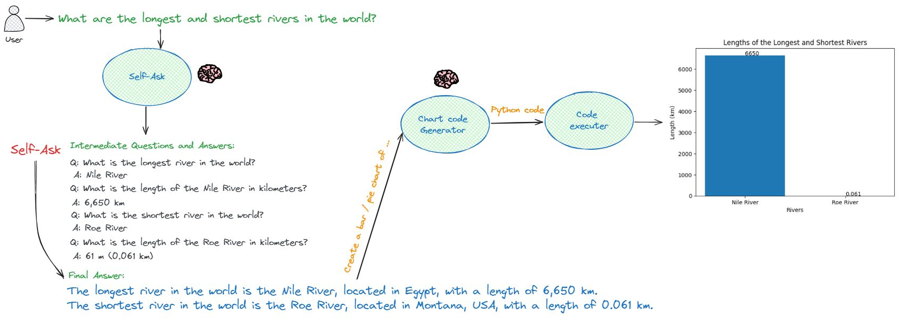

# Agentic Workflows

_"I think AI agent workflows will drive massive AI progress this year — perhaps even more than the next generation of foundation models. This is an important trend, and I urge everyone who works in AI to pay attention to it."_ Andrew Ng


---

## Introduction: 

LLMs are mostly used in zero-shot mode, prompting a model to generate an output directly. With an agent workflow, we can ask the LLM to go through some steps and iteration to get the final output. Such an iterative workflow yields much better results than a single pass. 

[LangGraph](https://python.langchain.com/docs/langgraph) is a library for building stateful, multi-actor applications with LLMs, built on top of (and intended to be used with) LangChain.

This code is the first step of using LangGraph to bulid generic and simple graphs even without LLMs.


## 1) LangGraph, minimal code, without AI


This is a simple code for using LangGrpah (even without any AI / LLMs). The graph is defined by:
- Nodes or functions
- Edges to connect the nodes

To keep the sate along the graph, a dictionary is usually used beween the calls. Here is a simple code how we define the nodes, edges and construct the graph. 

```
# Define the nodes
workflow.add_node("generate_number", generate_number)  # generation a number
workflow.add_node("check_number", check_number)  # check number

# Build graph
workflow.set_entry_point("generate_number")
workflow.add_edge("generate_number", "check_number")
workflow.add_conditional_edges(
    "check_number",
    decide_to_finish,
    {
        "end": END,
        "generate": "generate_number",
    },
)

# Compile
app = workflow.compile()

```

Let's see the code for using LangGraph in different simple situations:   

<a target="_blank" href="https://colab.research.google.com/drive/1ukuGbrG2gpKskiiYUUaEtV9McIajgUTF?usp=sharing">

</a>

- Guess the number, if fail, try again
- Try to guess a number or char, if you fail try again.
- Try to guess a number, if succeed, try to guess a char, if fail in number or chat, try again. 

## 2) 🤖 AI Text Assistant


This code develops a simple AI Writing Assistant, designed to generate text for you, evalaute the generated text and keep ehnacing it. This code ise developed based on LangChain, LangGraph and Gemini LLM. The example is for generating attractive post titles about some topic of your choice. Here is the graph in terms of nodes and edges. 

<a target="_blank" href="https://colab.research.google.com/drive/17sC2aqdEbgLkDCxSMhYpfbyWIGrcN080?usp=sharing">

</a>

```
# Define the nodes
workflow.add_node("generate", generate)  # generation initial txt
workflow.add_node("evaluate", evaluate)  # evalaute txt
workflow.add_node("rephrase", rephrase)  # re-phrase txt


# Build graph
workflow.set_entry_point("generate")
workflow.add_edge("generate", "evaluate")
workflow.add_edge("rephrase", "evaluate")
workflow.add_conditional_edges(
    "evaluate",
    decide_to_finish,
    {
        "end": END,
        "rephrase": "rephrase",
    },
)

# Compile
app = workflow.compile()

```

Here is a sample output: 

```
{'keys': {'generation': 'Unit Test: Protect Your Code', 'error': 'FAIL', 'subject': 'software unit testing', 'iterations': 1}}
{'keys': {'generation': '🛡️ Unit Test: The Ultimate Defense for Your Code 💪', 'error': 'None', 'subject': 'software unit testing', 'iterations': 2}}
```

## 3) AI Agents with tools  

The core idea of agents is to use a language model to choose a sequence of actions to take. In this example, we are building an AI agent powered by different tools (functions) such as:
- Web search
- Math calculations
- Paper arxiv
- Custom tools
- etc.
According to the user's question, the agent selects the suitable and the order of tool(s) to be used, where each tool has a natural langige desciption of its purpose. The following code shows how the tools are defined by a description and a function name.

<a target="_blank" href="https://colab.research.google.com/drive/14v7oNkAitTctzn2qHYylLfZ9RhRh0k_P?usp=sharing">

</a>

```
tools = [
        Tool(
            name = "Search",
            func=web_search_tool.run,
            description="useful for when you need to answer questions about current events or generic questions."
        ),
        Tool(
            name="Calculator",
            func=math_tool.run,
            description="useful when you need to answer questions about math and calculations."
        ),
        Tool(
            name="Wikipedia",
            func=wikipedia_tool.run,
            description="useful when you need an answer about encyclopedic general knowledge, "
        ),
        Tool(
            name="Arxiv",
            func=arxiv_tool.run,
            description="useful when you need to search for puplished papers"
        ),
        Tool(
        name="IbrahimSobh",
        func=custom_function,
        description="useful for when you need to answer questions about (Ibrahim Sobh)"
        )

    ]
```


Now let's see how our agent is going to answer our questions and use the provided tools: 

```
# our question
agent_chain.run("How old Tom Cruise should be on 2050?")
```

```
# Plan of actions
> Entering new AgentExecutor chain...
Action: Calculator
Action Input: 2050 - 1962

> Entering new LLMMathChain chain...
2050 - 1962```text
2050 - 1962

...numexpr.evaluate("2050 - 1962")...

Answer: 88
> Finished chain.

Observation: Answer: 88
Thought:Final Answer: 88

> Finished chain.
88

```

## 4) AI multi-agent and self-ask

Given a question provided by the user, we have mainly 2 agents:
- 🤖 **Research agent**: uses self-asking, a questioning technique where you ask yourself a series of questions to help you understand a topic or solve a problem. It involves breaking down a complex question into smaller, more manageable questions that are easier to answer. And eventually, answer the main question.
- 🤖 **Code agent**: based on the final answer, generates the code to draw a chart.

The code implements the following: 
- AI Python developer: Generates Python code given text, and returns results (charts)
- AI Researcher: An agent that breaks down a complex question into a series of simpler / follow up questions. This agent uses a search tool to look up answers to the simpler questions in order to answer the original complex question.

<a target="_blank" href="https://colab.research.google.com/drive/1xn2u-dQa0QfKkumsv7Gg9ao9Lr2lm1b1?usp=sharing">

</a>

Accordingly, we can ask the agent, get results, and generate a chart! Here is a nice example: 

```
# The question
res = llm.invoke("Use self asking to answer the question of in what country, names, and the lengthes in km, of the longest and shortest rivers in the world?, and show the intermediate questions and answers.")
```

```
# Generated intermediate (self asking) Questions and Answers: 

Q: What is the longest river in the world?
A: Nile River

Q: What is the length of the Nile River in kilometers?
A: 6,650 km

Q: What is the shortest river in the world?
A: Roe River

Q: What is the length of the Roe River in kilometers?
A: 61 m (0.061 km)

Final Answer:
The longest river in the world is the Nile River, located in Egypt, with a length of 6,650 km. The shortest river in the world is the Roe River, located in Montana, USA, with a length of 0.061 km.
```

The generated python code based on the answer: 

```
import matplotlib.pyplot as plt
# Data
rivers = ['Nile River', 'Roe River']
lengths = [6650, 0.061]

# Create the bar chart
plt.bar(rivers, lengths)

# Add numbers inside the bars
for i, v in enumerate(lengths):
    plt.text(i, v, str(v))

# Set the title and labels
plt.title('Lengths of the Longest and Shortest Rivers')
plt.xlabel('Rivers')
plt.ylabel('Length (km)')
	
# Show the plot
plt.show()
```

The generated chart based on the code based on trhe answer of the AI agents



## Conclusion 

According to [Deeplearning.ai](https://www.deeplearning.ai/the-batch/how-agents-can-improve-llm-performance/), Open source agent tools and the academic literature on agents are proliferating, making this an exciting time but also a confusing one. To help put this work into perspective, I developed this introduction to AI agentic agents that can be used and extended for the following patterns:
- **Reflection**: The LLM examines its own work to come up with ways to improve it. 
- **Tool Use**: The LLM is given tools such as web search, code execution, or any other function to help it gather information, take action, or process data.
- **Planning**: The LLM comes up with, and executes, a multistep plan to achieve a goal (for example, writing an outline for an essay, then doing online research, then writing a draft, and so on).
- **Multi-agent collaboration**: More than one AI agent work together, splitting up tasks and discussing and debating ideas, to come up with better solutions than a single agent would.


---
### For more, follow me: [Ibrahim Sobh](https://www.linkedin.com/in/ibrahim-sobh-phd-8681757/)  
---
