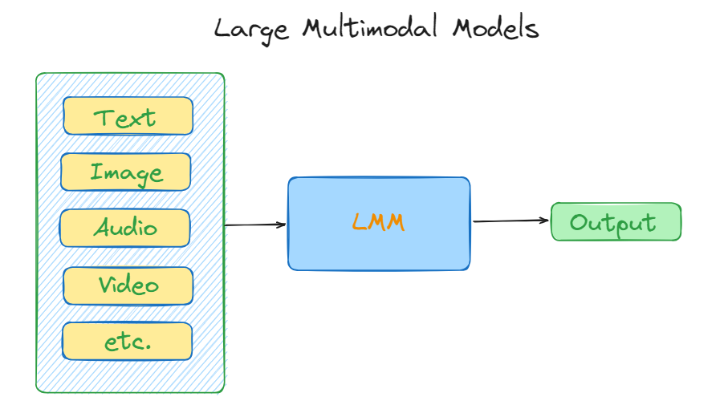
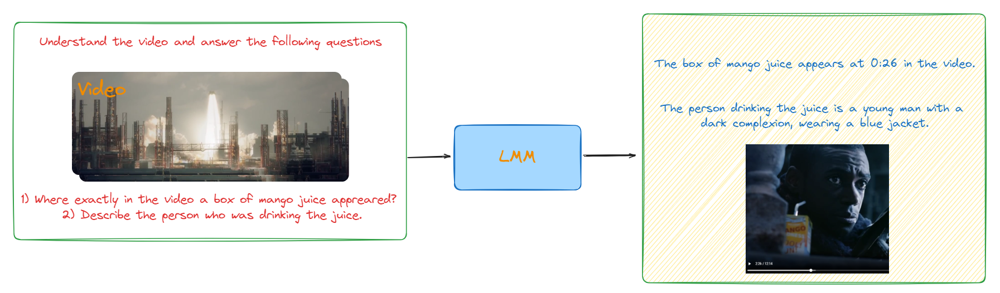

# LMMs: Large Multimodal Models 

## Introdcution 
Large Multimodal Models (LMMs) are a rapidly advancing field in AI that process and understand multiple data modalities simultaneously, such as images, audio, video, and text. LMMs have the potential to revolutionize human-technology interactions by combining language understanding with visual and audio perception, enabling more natural and intuitive interactions. The development of LMMs is a significant step towards building more general and capable AI systems. Key challenges include the need for large, diverse datasets and techniques like self-supervised learning. Despite challenges, the potential of LMMs is immense, attracting significant attention from academia and industry.

--- 

## LMMs with images 

In this introductory notebook, we explore the capabilities of Gemini large multimodal models, which excel in understanding content across various modalities, including images and text. This code demonstrates how to use Gemini to describe images accurately, ask insightful questions, and receive detailed answers. Additionally, it highlights the model’s advanced reasoning abilities, showcasing its potential in complex problem-solving scenarios. Whether you’re a developer, researcher, or enthusiast, this guide provides a comprehensive overview of leveraging Gemini’s powerful features for diverse applications.

--- 

## LMMs  with Audio and Video

In this notebook, we delve into the versatile capabilities of Gemini large multimodal models (LMMs). The notebook guides you through the process of using Gemini to understand, summarize and transcripe audio and video files effectively. Additionally, it demonstrates how to leverage Gemini for searching and answering user questions, with a focus on reasoning through the responses. This comprehensive guide is ideal for developers and researchers looking to harness the full potential of multimodal functionalities for diverse applications.

