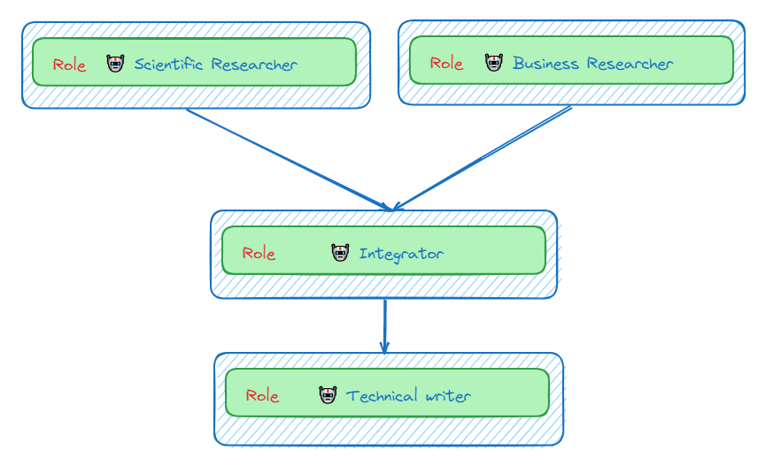

# AI Multi-Agent Systems 

## Introduction:
The power of Multi-agent AI has more to offer. Frameworks for building multi-agent systems are designed to enable AI agents to have roles, share goals, and operate in a cohesive unit. Whether you're building an automated customer service, or research team, multi-agents systems provide the main building blocks for sophisticated multi-agent interactions.

For example, [crewAI](https://www.crewai.com/) is an open-source framework for building multi-agent systems that can automate complex, multi-step tasks. Here are the main features of crewAI:
- Role-playing: Assign specialized roles to agents 
- Memory: Provide agents with short-term, long-term, and shared memory
- Tools: Assign pre-built and custom tools to each agent (e.g. for web search)
- Guardrails: Effectively handle errors, hallucinations, and infinite loops
- Cooperation: Perform tasks in series, in parallel, and hierarchically.
- LLMs: GPT, Gemini, Llama, etc.

 

---

## 1) Simple multi-agent research team

<a target="_blank" href="https://colab.research.google.com/drive/1HEOVY_aDmW7pDHpPckpitzD6RcuaRLhC?usp=sharing">

</a>

 

This notebook demonstrates the use of a simple multi-agent system built with the crewai library for performing a research task. The system simulates a research team with an AI Researcher, AI Expert Supervisor, and Technical Writer, who collaborate to propose, assess, and write an abstract for a research paper on recent advances in LLMs (Large Language Models)

Agent example: 
```
Supervisor = Agent(
    role="AI Expert",
    goal="Make assessment on how contrbution is novel and impactful.",
    backstory="""You are an AI expert supervisor with a deep understanding of AI, LLMs and recent related research.
		Your expertise lies not just in knowing the technology but in foreseeing how it can be leveraged to solve real-world problems and drive business innovation.
		Your insights are crucial.""",
    verbose=True,  # enable more detailed or extensive output
    allow_delegation=True,  # enable collaboration between agent
    llm=llm
)
```

Task exmaple:
```
task2 = Task(
    description="""Analyze proposals for new ideas or contributions in terms of novelty and impact.
		Make a report with clear assessment.
    """,
    agent=Supervisor,
    expected_output='An assessment report with at least one clear proposed enhancment.'
```

Define the crew:
```
crew = Crew(
    agents=[Researcher, Supervisor, Writer],
    tasks=[task1, task2, task3],
    verbose=2,
    process=Process.sequential,
)

result = crew.kickoff()
```

Result example: 

**Title: 
Leveraging LLMs for Personalized Learning in Higher Education: A Novel Framework for Enhancing Student Engagement and Success**

**Abstract**: 

This research paper presents a novel framework for leveraging Large Language Models (LLMs) to enhance personalized learning in higher education. The proposed framework integrates LLMs into the learning process, providing students with real-time assistance, feedback, and guidance that is tailored to their individual needs and preferences. The framework adopts a holistic approach to personalized learning by considering not only the student's academic performance but also their cognitive abilities, learning preferences, and motivational factors. The paper discusses the novelty and impact of the proposed idea, highlighting its potential to improve student engagement, increase success rates, and create a more positive and fulfilling learning experience. Additionally, the paper proposes an enhancement to the framework by exploring the use of LLMs to create personalized learning experiences for students with disabilities, making higher education more accessible and inclusive for all. The findings of this research have the potential to revolutionize the way students learn in higher education, providing them with personalized learning experiences that are tailored to their individual needs and goals.

---

## 2) Multi-agent research team with web search tool and memory

<a target="_blank" href="https://colab.research.google.com/drive/1k5EFce4dnHTfqtzhqHaOPm10WSw_FsGy?usp=sharing">

</a>

 

This notebook demonstrates how to build a multi-agent research team using CrewAI. The agents can use tools like web search and memory to collaborate on tasks of Proposing novel LLM research contributions, Evaluating the novelty and impact of proposed contributions and Writing research titles and abstracts. The goal of this system is to streamline the research process by leveraging AI agents for idea generation, evaluation, and writing.
- **Memory** to aid agents to remember, reason, and learn from past interactions.
- **Web search tool** to for finding a novel and impactful research contribution

Define a web search tool: 
```
from langchain_community.tools import DuckDuckGoSearchRun
search_tool = DuckDuckGoSearchRun(max_results=3)
```

Tools can be assigned to agents:
```
Researcher = Agent(
    role="AI Researcher",
    goal="Find out a novel LLMs research contribution",
    backstory="""You are a researcher in the area of LLMs. This is crucial for
		finding out a novel research contribution. You are good at coming up
		with new and impactful contributions to the LLMs research.
		""",
    verbose=True,  # enable more detailed or extensive output
    allow_delegation=True,  # enable collaboration between agent
    llm=llm,
    tools=[search_tool], # web search tool
)
```

Adding memory to the crew with an embedding model of our choice:
```
crew = Crew(
    agents=[Researcher, Supervisor, Writer],
    tasks=[task1, task2, task3],
    verbose=2,
    process=Process.sequential,
    memory=True,
    embedder={
        "provider": "google",
        "config":{
            "model": 'models/embedding-001',
            "task_type": "retrieval_document",
            "title": "Embeddings for Embedchain"
            }
        }
)
```

Result example: 

**Title: Enhancing the Factual Grounding and Reasoning Capabilities of LLMs through Knowledge Base Integration**

**Abstract**:

This paper presents a novel approach to enhancing the factual grounding and reasoning capabilities of large language models (LLMs) by integrating a structured knowledge base into their training process. The proposed approach aligns the LLM's representations with the knowledge base, enabling it to reason over factual knowledge and generate more accurate and consistent responses. We evaluate the effectiveness of our approach on a range of natural language processing tasks and demonstrate significant improvements over existing methods. Our contribution has the potential to significantly advance the field of LLMs and open up new possibilities for applications that require robust factual grounding and reasoning capabilities.

---

### 3) Multi agent research team with an LLM Manager

<a target="_blank" href="https://colab.research.google.com/drive/1c9mowbiTC0RcDzjvXot1tQnBRWsMr9b4?usp=sharing">

</a>

 

This code implements a hierarchical multi-agent system designed to simulate a research team with a manager. The system aims to automate the process of generating research contributions in the field of Large Language Models (LLMs).
The manager's role is to oversee the entire research process, including:Task Allocation: Assigning tasks to agents (Researcher, Supervisor, Writer) based on their capabilities, Coordination, and validation. This hierarchical structure mimics a real-world research team, enhancing organization and efficiency in generating novel LLM research contributions. By specifying a manager it oversees task execution, including planning, delegation, and validation. The manager allocates tasks to agents based on their capabilities, reviews outputs, and assesses task completion.

Adding LLM Manager for the hierarchical process
```
# Define the Crew
crew = Crew(
    agents=[Researcher, Supervisor, Writer],
    tasks=[task1, task2, task3],
    verbose=True,
    process=Process.hierarchical,
    manager_llm=llm,
    memory=True,
    embedder={
        "provider": "google",
        "config":{
            "model": 'models/embedding-001',
            "task_type": "retrieval_document",
            "title": "Embeddings for Embedchain"
            }
        }
)
```
In the definition of a task, agent responsible for the task can be assigned either directly or by the crew's process.
```
task2 = Task(
    description="""Evaluate proposed contribution in terms of novelty and impact.
		Write a short report with clear possible enhacements, if any.
    If no enhacements, then you may declare that the current proposal is good enough and ready to be written as title and abstact.
    """,
    agent=Supervisor, 
    expected_output='Either an evaluation report with clear potential enhancments for the proposed contribution, or if no furthur enhacements needed, then the outpout is a short paragraph summary of the the proposed contribution.'
)
```

Result Example: 

**Title: Enhancing Contextualized Reasoning Abilities in LLMs: A Novel Approach and Evaluation**

**Abstract**: 

This research paper presents a novel approach to enhance the contextualized reasoning abilities of Large Language Models (LLMs). The proposed approach leverages recent advancements in natural language processing and machine learning to enable LLMs to reason more effectively within specific contexts. The paper begins by providing a comprehensive overview of the current state-of-the-art in LLM research, highlighting the limitations of existing models in handling complex reasoning tasks. The proposed approach is then described in detail, outlining its key components and underlying algorithms. The paper proceeds to present a thorough evaluation of the proposed approach, demonstrating its effectiveness in improving the reasoning abilities of LLMs on a range of benchmark datasets. The results of the evaluation indicate that the proposed approach significantly outperforms existing methods, achieving state-of-the-art performance on several reasoning tasks. The paper concludes by discussing the potential implications of the proposed approach for various applications, such as natural language understanding, question answering, and dialogue generation.

---

## 4) Multi agent research team with an agent as a custom Manager

<a target="_blank" href="https://colab.research.google.com/drive/1NirBFAF2NUQl5x-CNPKeuXgk-e1_2ty_?usp=sharing">

</a>

 

This code defines a multi-agent system designed to act as a research assistant in the field of Large Language Models (LLMs). It includes agents for research, supervision, and writing, each with specific roles and goals. The agents collaborate to propose, evaluate, and refine a novel research contribution in the LLM domain. The agent manager coordinates the efforts of these agents, ensuring efficient task completion and high-quality output, the agents work together effectively to achieve the overall goal.

Define the manager agent:
```
manager = Agent(
    role="Research Manager",
    goal="Efficiently manage the crew and ensure high-quality task completion",
    backstory="You're an experienced project manager with research background in the area of {research_area}, skilled in overseeing complex tasks and projects and guiding teams to success. Your role is to coordinate the efforts of the crew members, ensuring that each task is completed to the highest standard. Ensuring the the crew memeber are utilized efficiently.",
    allow_delegation=True,
    llm=llm
    )
```

Define the task: 
```
task = Task(
    description="""
    1) Search for and propose a novel and impactful contribution as a new LLMs research paper.
    2) Evalaute the proposed contribution in terms of novelty and impact.
    3) Propose clear possible enhacements, if any, to be conducted to enhance the contribution.
    4) Apply enhancements to the proposed contribution.
    5) After repeated cycles of proposing and enhancing the contribution, and if the contribution is good enough, write the final output as a title and abstact of the contribution.
    """,
    expected_output='Title of a paper, and the abstract as a paragraph. If you are going to use the search tool, replace the search positional argument to be search_query'
)
```

Define crew with a custom manager agent:
```
crew = Crew(
    agents=[Researcher, Supervisor, Writer],
    tasks=[task],
    verbose=True,
    manager_agent=manager, # custom manager
    process=Process.hierarchical,
    )
```

Result example:

**Title: Enhancing Large Language Models for Improved Accuracy and Contextual Relevance**

**Abstract**: 

Large Language Models (LLMs) have revolutionized natural language processing tasks. However, they still face challenges with accuracy and contextual relevance. This paper proposes several enhancements to address these limitations. Firstly, we increase the number of beams used in the decoder to improve the accuracy of the output sequence. Secondly, we customize the LLM for domain-specific data to provide more relevant and contextually appropriate responses. Thirdly, we incorporate retrieval augmented generation (RAG) to address hallucinations and out-of-date training data. Finally, we specify the writing style, tone, audience, and response to guide the LLM's output. Experimental results demonstrate that these enhancements significantly improve the accuracy and contextual relevance of the LLM's responses.

--- 

## 5) Async tasks for Idea Factory

<a target="_blank" href="https://colab.research.google.com/drive/1UxJl2LOsVpfQx9hRK_qFqP7tdEqjuveD?usp=sharing">

</a>

 

This example demonstrates how to build a multi-agent system using the crewai library. The system simulates a research environment with agents acting as researchers, an integrator, and a writer, collaborating to generate and refine research and business ideas on a given topic. It leverages a large language model (LLM) for text generation and tools like web search for information gathering. Async task: the task executes asynchronously, allowing progression without waiting for completion. Multi agent system as a research assistant This is a simple multi agent system with:
- Two researchers (Scientific and Business) wokring in parallel (Async) and thier proposed ideas are intergrated into a more appealing idea.
- Memory to aid agents to remember, reason, and learn from past interactions.
- Web search to for finding a novel and impactful research contribution

Define Async Tasks: 
```
async_execution=True
```

```
task1 = Task(
    description="""
    Search and propose a novel and impactful research idea in the area of {topic}.
    """,
    async_execution=True,	#If set, the task executes asynchronously, allowing progression without waiting for completion.
    agent=Scientific_Researcher,
    expected_output='A short paragraph of the new proposed research idea and its expected impact from a research point of view.'
)

task2 = Task(
    description="""
    Search and propose a novel and impactful business idea in the area of {topic}.
    """,
    async_execution=True,	#If set, the task executes asynchronously, allowing progression without waiting for completion.
    agent=Business_Researcher,
    expected_output='A short paragraph of the new proposed business idea and its expected impact from a business point of view.'
)

```

Define the crew
```
# Define the Crew
crew = Crew(
    agents=[Scientific_Researcher, Business_Researcher, Integrator, Writer],
    tasks=[task1, task2, task3, task4],
    verbose=2,
    process=Process.sequential,
)

# Kickoff
result = crew.kickoff(inputs={"topic": "Self-driving vehicles"})
```


Result example:

**Title: The Future of Transportation: A Subscription-Based Model for Self-Driving Vehicles**

**Abstract:**

The integration of self-driving vehicles and subscription-based services has the potential to revolutionize the transportation industry. This innovative business model offers several advantages for both consumers and businesses.
From a consumer perspective, subscription-based self-driving vehicles provide convenience, affordability, and accessibility. Users can summon a self-driving car on demand, eliminating the need for car ownership and maintenance. The vehicles are equipped with advanced technologies that enable them to learn and adapt to different driving environments, ensuring safety and efficiency.
For businesses, this model offers opportunities for revenue generation and customer acquisition. Subscription fees provide a recurring revenue stream, while the data collected from vehicle usage can be leveraged for product development and service enhancements. Additionally, the service can be integrated with other mobility platforms, creating a seamless and comprehensive transportation ecosystem.
The environmental impact of subscription-based self-driving vehicles is also significant. By reducing the number of vehicles on the road, this model contributes to congestion reduction, air pollution mitigation, and energy conservation. The vehicles' ability to learn and adapt to traffic patterns further optimizes their efficiency and reduces emissions.
In conclusion, the integration of self-driving vehicles and subscription-based services presents a transformative business model that addresses the evolving needs of consumers and businesses. It offers convenience, affordability, accessibility, and sustainability, while also driving innovation and economic growth in the transportation sector.

--- 

### Conclusion:
In the ever-evolving landscape of artificial intelligence, multi-agent systems stand out as powerful tools with immense potential. These frameworks enable AI agents to collaborate, share goals, and operate seamlessly within cohesive units. Whether you’re developing an automated customer service platform or a cutting-edge research team, multi-agent systems offer several key advantages. In summary, multi-agent AI systems empower individuals and organizations to tackle complex challenges by leveraging the collective intelligence of interconnected agents. As we continue to explore their potential, these systems promise a future where cooperation and synergy drive our lives.

