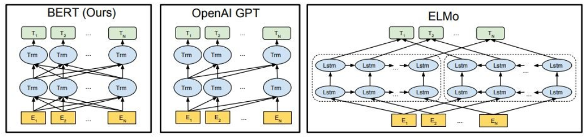

# Large Language Models (llms)

---

## Introduction: What is a language model?

The main purpose of **Language Models** is to assign a probability to a sentence, to distinguish between the more likely and the less likely sentences.

### Applications of language models:
1. Machine Translation: P(high winds tonight) > P(large winds tonight)
2. Spelling correction: P(about fifteen minutes from) > P(about fifteen minuets from)
3. Speech Recognition: P(I saw a van) > P(eyes awe of an)
4. Authorship identification: who wrote some sample text
5. Summarization, question answering, dialogue bots, etc.

For Speech Recognition, we use not only the acoustics model (the speech signal), but also a language model. Similarly, for Optical Character Recognition (OCR), we use both a vision model and a language model. Language models are very important for such recognition systems.

> Sometimes, you hear or read a sentence that is not clear, but using your language model, you still can recognize it at a high accuracy despite the noisy vision/speech input.

The language model computes either of:
- The probability of a sentence or sequence of words: $P(w_1, w_2, w_3, ..., w_n)$
- The probability of an upcoming word: $P(w_5 | w_1, w_2, w_3, w_4)$

The Chain Rule: $P(x_1, x_2, x_3, …, x_n) = P(x_1)P(x_2|x_1)P(x_3|x_1,x_2)…P(x_n|x_1,…,x_{n-1})$

> $P(The, water, is, so, clear) = P(The) × P(water|The) × P(is|The, water) × P(so|The, water, is) × P(clear | The, water, is, so)$

What just happened? The Chain Rule is applied to compute the joint probability of words in a sentence.

---

## Statistical Language Modeling:

### n-gram Language Models
Using a large amount of text (corpus such as Wikipedia), we collect statistics about how frequently different words are, and use these to predict the next word. For example, the probability that a word w comes after these three words *students opened their* can be estimated as follows: 
- $P(w | students, opened, their) = count of (students, opened, their, w) / count of (students, opened, their)$

The above example is a 4-gram model. And we may get: 
- $P(books | students, opened, their) = 0.4$
- $P(cars | students, opened, their) = 0.05$
- $P(... | students, opened, their) = ...$

> We can conclude that the word “books” is more probable than “cars” in this context. 

Accordingly, arbitrary text can be generated from a language model given starting word(s), by sampling from the output probability distribution of the next word, and so on.

<!--
### How to estimate these probabilities?

Amusing we have a large text corpus (data set like Wikipedia), we can count and divide as follows:

- $P(clear |The, water, is, so) = Count (The, water, is, so, clear) / Count (The, water, is, so)$
-->

Sparsity: Sometimes we do not have enough data to estimate the following: 
- $P(clear |The, water, is, so) = Count (The, water, is, so, clear) / Count (The, water, is, so)$

Markov Assumption (Simplifying assumption):
- $P(clear |The, water, is, so) ≈ P(clear | so)$
- Or $P(clear |The, water, is, so) ≈ P(clear | is, so)$

Formally:
- $P(w_1 w_2 … w_n ) ≈ ∏i P(w_i | w_{i−k} … w_{i−1})$
- $P(w_i | w_1 w_2 … w_{i−1}) ≈ P(w_i | w_{i−k} … w_{i−1})$
- Unigram model: $P(w_1 w_2 … w_n ) ≈ ∏i P(w_i)$
- Bigram model: $P(w_i | w_1 w_2 … w{i−1}) ≈ P(w_i | w_{i−1})$

> We can extend to trigrams, 4-grams, 5-grams, and N-grams.

 In general, this is an insufficient model of language because the language has long-distance dependencies. However, in practice, these 3,4 grams work well for most of the applications.

<!---
### Estimating bigram probabilities:
The Maximum Likelihood Estimate (MLE): of all the times we saw the word wi-1, how many times it was followed by the word wi

$P(w_i | w_{i−1}) = count(w_{i−1}, w_i) / count(w_{i−1})$
Practical Issue: We do everything in log space to avoid underflow
$log(p1 × p2 × p3 × p4 ) = log p1 + log p2 + log p3 + log p4$
-->

### Building Statistical Language Models:

#### Toolkits

- [SRILM](http://www.speech.sri.com/projects/srilm/) is a toolkit for building and applying statistical language models, primarily for use in speech recognition, statistical tagging and segmentation, and machine translation. It has been under development in the SRI Speech Technology and Research Laboratory since 1995.
- [KenLM](https://kheafield.com/code/kenlm/) is a fast and scalable toolkit that builds and queries language models.

#### N-gram Models

Google's N-gram Models Belong to You: Google Research has been using word n-gram models for a variety of R&D projects. [Google N-Gram](https://ai.googleblog.com/2006/08/all-our-n-gram-are-belong-to-you.html) processed 1,024,908,267,229 words of running text and published the counts for all 1,176,470,663 five-word sequences that appear at least 40 times.

The counts of text from the Linguistics Data Consortium [LDC](https://www.ldc.upenn.edu/) are as follows:

```
File sizes: approx. 24 GB compressed (gzip'ed) text files

Number of tokens:    1,024,908,267,229
Number of sentences:    95,119,665,584
Number of unigrams:         13,588,391
Number of bigrams:         314,843,401
Number of trigrams:        977,069,902
Number of fourgrams:     1,313,818,354
Number of fivegrams:     1,176,470,663
```


The following is an example of the **4-gram** data in this corpus:

```
serve as the incoming 92
serve as the incubator 99
serve as the independent 794
serve as the index 223
serve as the indication 72
serve as the indicator 120
serve as the indicators 45
serve as the indispensable 111
serve as the indispensible 40
```

For example, the sequence of the four words "serve as the indication" has been seen in the corpus 72 times.


Try some examples of your own using [Google Books Ngram Viewer](https://books.google.com/ngrams/) and see the frequency of likely and unlikely N-grams.


---

## Evaluation: How good is our model?

> Does our language model prefer good (likely) sentences to bad ones?

### Extrinsic evaluation:

1. For comparing models A and B, put each model in a task (spelling, corrector, speech recognizer, machine translation)
2. Run the task and compare the accuracy for A and for B
3. Best evaluation but not practical and time consuming!

### Intrinsic evaluation:

- **Intuition**: The best language model is one that best predicts an unseen test set (assigns high probability to sentences).
- **Perplexity** is the standard evaluation metric for Language Models.
- **Perplexity** is defined as the inverse probability of a text, according to the Language Model.
- A good language model should give a lower Perplexity for a test text. Specifically, a lower perplexity for a given text means that text has a high probability in the eyes of that Language Model.

> Perplexity is the inverse probability of the test set, normalized by the number of words


> Lower perplexity = Better model

> Perplexity is related to branch factor: On average, how many things could occur next.


### Limitations of Statistical Language
 
- What if “students opened their” never occurred in data? (Sparsity problem) We may condition on “opened their” instead (_backoff_).
- What if “students opened their ” never occurred in data? We may add a small 𝛿 to the count for every w (_smoothing_).
- Large storage requirements: Need to store count for all n-grams you saw in the corpus.

---

## Further readings:

- [Book: Speech and Language Processing; Daniel Jurafsky](https://www.amazon.com/Speech-Language-Processing-Daniel-Jurafsky/dp/0131873210)
- [Video: Natural Language Processing](https://www.youtube.com/playlist?list=PLQiyVNMpDLKnZYBTUOlSI9mi9wAErFtFm)
- [Gentle Introduction to Statistical Language Modeling and Neural Language Models](https://machinelearningmastery.com/statistical-language-modeling-and-neural-language-models/)


---

## Neural Language Models (NLM)

- **What is the problem?** One of the biggest challenges in natural language processing (NLP) is the shortage of training data for many distinct tasks. However, modern deep learning-based NLP models improve when trained on millions, or billions, of annotated training examples.

- **Pre-training is the solution:** To help close this gap, a variety of techniques have been developed for training general-purpose language representation models using the enormous amount of unannotated text. The pre-trained model can then be fine-tuned on small data for different tasks like question answering and sentiment analysis, resulting in substantial accuracy improvements compared to training on these datasets from scratch.

NLM usually (but not always) uses an RNN to learn sequences of words (sentences, paragraphs, … etc) and hence can predict the next word. 

Advantages: 
- Can process variable-length input
- Computations for step t use information from many steps back
- Model size doesn’t increase for longer input, the same weights are applied on every timestep.


As depicted, At each step, we have a probability distribution of the next word over the vocabulary.
Disadvantages: 
- Recurrent computation is _slow_ (sequential, one step at a time)
- In practice, for long sequences, difficult_ to access information_ from many steps back

### Transformer-based Language models   

The Transformer architecture was proposed in the paper [Attention is All You Need](https://arxiv.org/abs/1706.03762), used for the Neural Machine Translation task (NMT), consisting of: 
- **Encoder**: Network that encodes the input sequence.
- **Decoder**: Network that generates the output sequences conditioned on the input.

As mentioned in the paper: 
> "_We propose a new simple network architecture, the Transformer, based solely on attention mechanisms, dispensing with recurrence and convolutions entirely_"

The main idea of **attention** can be summarized as mentioned in the OpenAi's [article](https://openai.com/blog/sparse-transformer/):
> "_... every output element is connected to every input element, and the weightings between them are **dynamically calculated based upon the circumstances**, a process called attention._"

Based on this architecture (the vanilla Transformers!), **encoder or decoder** components can be used alone to enable massive pre-trained generic models that can be fine-tuned for downstream tasks such as text classification, translation, summarization, question answering, etc. For Example:

- "Pre-training of Deep Bidirectional Transformers for Language Understanding" [BERT](https://arxiv.org/abs/1810.04805) is mainly based on the encoder architecture trained on massive text datasets to predict randomly masked words and "is-next sentence" classification tasks.
- [GPT](https://arxiv.org/pdf/2005.14165.pdf), on the other hand, is an auto-regressive generative model that is mainly based on the decoder architecture, trained on massive text datasets to predict the next word (unlike BERT, GPT can generate sequences).

> These models, BERT and GPT for instance, can be considered as the NLP's ImageNET.



As shown, BERT is deeply bidirectional, OpenAI GPT is unidirectional, and ELMo is shallowly bidirectional.

Pre-trained representations can be:
- **Context-free**: such as word2vec or GloVe that generates a single/fixed word embedding (vector) representation for each word in the vocabulary (independent of the context of that word at test time)
- **Contextual**: generates a representation of each word based on the other words in the sentence.

Contextual Language models can be:
- **Causal language model (CML)**: Predict the next token passed on previous ones. (GPT)
- **Masked language model (MLM)**: Predict the masked token based on the surrounding contextual tokens (BERT)
  
#### To do
- Code Bert https://colab.research.google.com/drive/17sJR6JwoQ7Trr5WsUUIpHLZBElf8WrVq?usp=sharing#scrollTo=-u2Feyk5Gg7o
- Code GPT
- Code Falcon
- Code GPT4ALL
- Code CodeTF
- Chat with my docs
- etc.

