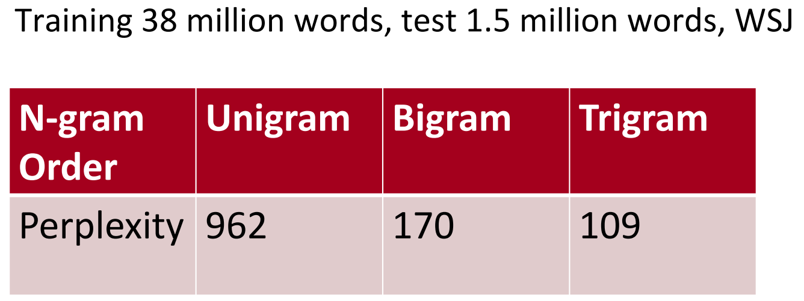

# Large Language Models (llms)

---

## Introduction: What is a language model?

The main purpose of **Language Models** is to assign a probability to a sentence, to distinguish between the more likely and the less likely sentences.

### Applications of language models:
1. Machine Translation: P(high winds tonight) > P(large winds tonight)
2. Spelling correction: P(about fifteen minutes from) > P(about fifteen minuets from)
3. Speech Recognition: P(I saw a van) > P(eyes awe of an)
4. Summarization, question answering, etc.

For Speech Recognition, we use not only the acoustics model (the speech signal), but also a language model. Similarly, for Optical Character Recognition (OCR), we use both a vision model and a language model. Language models are very important for such recognition systems.

> Sometimes, you hear or read a sentence that is not clear, but using your language model, you still can recognize it at a high accuracy despite the noisy vision/speech input.

The language model computes either of:
- The probability of a sentence or sequence of words: $P(w_1, w_2, w_3, ..., w_n)$
- The probability of an upcoming word: $P(w_5 | w_1, w_2, w_3, w_4)$

The Chain Rule: $P(x_1, x_2, x_3, …, x_n) = P(x_1)P(x_2|x_1)P(x_3|x_1,x_2)…P(x_n|x_1,…,x_{n-1})$

> $P(The, water, is, so, clear) = P(The) × P(water|The) × P(is|The, water) × P(so|The, water, is) × P(clear | The, water, is, so)$

What just happened? The Chain Rule is applied to compute the joint probability of words in a sentence

---

## Statistical Language Modeling:

### How to estimate these probabilities?

Amusing we have a large text corpus (data set of test like Wikipedia), we can count and divide as follows:

- $P(clear |The, water, is, so) = Count (The, water, is, so, clear) / Count (The, water, is, so)$

However, we can't do that! We’ll never see enough data for estimating these!

Markov Assumption (Simplifying assumption)
- $P(clear |The, water, is, so) ≈ P(clear | so)$
- Or $P(clear |The, water, is, so) ≈ P(clear | is, so)$

Formally:
- $P(w_ 1 w_2 … w_n ) ≈ ∏i P(w_i | w_{i−k} … w_{i−1})$
- $P(w_i | w_1 w_2 … w_{i−1}) ≈ P(w_i | w_{i−k} … w_{i−1})$
- Unigram model: $P(w_1 w_2 … w_n ) ≈ ∏i P(w_i)$
- Bigram model: $P(w_i | w_1 w_2 … w{i−1}) ≈ P(w_i | w_{i−1})$

> We can extend to trigrams, 4-grams, 5-grams, and N-grams.

 In general, this is an insufficient model of language because the language has long-distance dependencies. However, in practice, these 3,4 grams work well for most of the applications.

### Estimating bigram probabilities:
The Maximum Likelihood Estimate (MLE): of all the times we saw the word wi-1, how many times it was followed by the word wi

$P(w_i | w_{i−1}) = count(w_{i−1}, w_i) / count(w_{i−1})$
Practical Issue: We do everything in log space to avoid underflow
$log(p1 × p2 × p3 × p4 ) = log p1 + log p2 + log p3 + log p4$


### Building Statistical Language Models:

#### Toolkits

- [SRILM](http://www.speech.sri.com/projects/srilm/) is a toolkit for building and applying statistical language models, primarily for use in speech recognition, statistical tagging and segmentation, and machine translation. It has been under development in the SRI Speech Technology and Research Laboratory since 1995.
- [KenLM](https://kheafield.com/code/kenlm/) is a fast and scalable toolkit that builds and queries language models.

#### N-gram Models

Google's N-gram Models Belong to You: Google Research has been using word n-gram models for a variety of R&D projects. [Google N-Gram](https://ai.googleblog.com/2006/08/all-our-n-gram-are-belong-to-you.html) processed 1,024,908,267,229 words of running text and published the counts for all 1,176,470,663 five-word sequences that appear at least 40 times.

The counts of text from the Linguistics Data Consortium [LDC](https://www.ldc.upenn.edu/) are as follows:

```
File sizes: approx. 24 GB compressed (gzip'ed) text files

Number of tokens:    1,024,908,267,229
Number of sentences:    95,119,665,584
Number of unigrams:         13,588,391
Number of bigrams:         314,843,401
Number of trigrams:        977,069,902
Number of fourgrams:     1,313,818,354
Number of fivegrams:     1,176,470,663
```


The following is an example of the **4-gram** data in this corpus:

```
serve as the incoming 92
serve as the incubator 99
serve as the independent 794
serve as the index 223
serve as the indication 72
serve as the indicator 120
serve as the indicators 45
serve as the indispensable 111
serve as the indispensible 40
```

For example, the sequence of the four words "serve as the indication" has been seen in the corpus 72 times.


Try some examples of your own using [Google Books Ngram Viewer](https://books.google.com/ngrams/) and see the frequency of likely and unlikely N-grams.


---

## Evaluation: How good is our model?

> Does our language model prefer good (likely) sentences to bad ones?

### Extrinsic evaluation:

1. For comparing models A and B, put each model in a task (spelling, corrector, speech recognizer, machine translation)
2. Run the task and compare the accuracy for A and for B
3. Best evaluation but not practical and time consuming!

### Intrinsic evaluation:

- Intuition: The best language model is one that best predicts an unseen test set (assigns high probability to sentences).

> Perplexity is the inverse probability of the test set, normalized by the number of words


> Lower perplexity = Better model

> Perplexity is related to branch factor: On average, how many things could occur next.



Using the Wall Street Journal (WSJ) Corpus: As expected, it is clear that the Trigram model is better than the Bigram model. Similarly, the bigram model is better than the naive unigram model. (Remember: Lower perplexity (less branching) = Better model)


---

## Further readings:

- [Book: Speech and Language Processing; Daniel Jurafsky](https://www.amazon.com/Speech-Language-Processing-Daniel-Jurafsky/dp/0131873210)
- [Video: Natural Language Processing](https://www.youtube.com/playlist?list=PLQiyVNMpDLKnZYBTUOlSI9mi9wAErFtFm)
- [Gentle Introduction to Statistical Language Modeling and Neural Language Models](https://machinelearningmastery.com/statistical-language-modeling-and-neural-language-models/)

