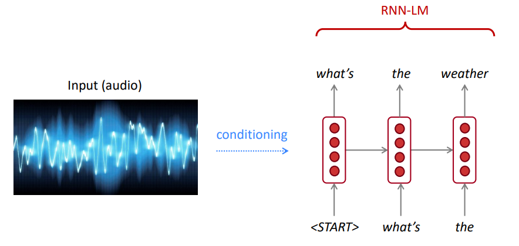

# Large Language Models (llms)


_Source_ [A Survey of Large Language Models](https://arxiv.org/pdf/2303.18223.pdf)

---

## Introduction: What is a language model?

Simple definition: Language Modeling is the task of predicting what word comes next.

"The dog is playing in the ..."
- park
- woods
- snow
- office
- university
- Neural network
- ? 

The main purpose of **Language Models** is to assign a probability to a sentence, to distinguish between the more likely and the less likely sentences.

### Applications of language models:
1. Machine Translation: P(high winds tonight) > P(large winds tonight)
2. Spelling correction: P(about fifteen minutes from) > P(about fifteen minuets from)
3. Speech Recognition: P(I saw a van) > P(eyes awe of an)
4. Authorship identification: who wrote some sample text
5. Summarization, question answering, dialogue bots, etc.

For Speech Recognition, we use not only the acoustics model (the speech signal), but also a language model. Similarly, for Optical Character Recognition (OCR), we use both a vision model and a language model. Language models are very important for such recognition systems.

> Sometimes, you hear or read a sentence that is not clear, but using your language model, you still can recognize it at a high accuracy despite the noisy vision/speech input.

The language model computes either of:
- The probability of an upcoming word: $P(w_5 | w_1, w_2, w_3, w_4)$
- The probability of a sentence or sequence of words (according to the Language Model): $P(w_1, w_2, w_3, ..., w_n)$


> Language Modeling is a subcomponent of many NLP tasks, especially those involving generating text or estimating the probability of text.


The Chain Rule: $P(x_1, x_2, x_3, …, x_n) = P(x_1)P(x_2|x_1)P(x_3|x_1,x_2)…P(x_n|x_1,…,x_{n-1})$

> $P(The, water, is, so, clear) = P(The) × P(water|The) × P(is|The, water) × P(so|The, water, is) × P(clear | The, water, is, so)$

What just happened? The Chain Rule is applied to compute the joint probability of words in a sentence.

---

## Statistical Language Modeling:

### n-gram Language Models
Using a large amount of text (corpus such as Wikipedia), we collect statistics about how frequently different words are, and use these to predict the next word. For example, the probability that a word _w_ comes after these three words *students opened their* can be estimated as follows: 
- P(w | students opened their) = count(students opened their w) / count(students opened their)

The above example is a 4-gram model. And we may get: 
- P(books | students opened their) = 0.4
- P(cars | students, opened, their) = 0.05
- P(... | students, opened, their) = ...

> We can conclude that the word “books” is more probable than “cars” in this context. 

We ignored the previous context before "students opened their"

> Accordingly, arbitrary text can be generated from a language model given starting word(s), by sampling from the output probability distribution of the next word, and so on.

We can train an LM on any kind of text, then generate text in that style (Harry Potter, etc.). 

<!--
### How to estimate these probabilities?

Amusing we have a large text corpus (data set like Wikipedia), we can count and divide as follows:

- $P(clear |The, water, is, so) = Count (The, water, is, so, clear) / Count (The, water, is, so)$
-->


<!--
Sparsity: Sometimes we do not have enough data to estimate the following: 
- $P(clear |The, water, is, so) = Count (The, water, is, so, clear) / Count (The, water, is, so)$

Markov Assumption (Simplifying assumption):
- $P(clear |The, water, is, so) ≈ P(clear | so)$
- Or $P(clear |The, water, is, so) ≈ P(clear | is, so)$


Formally:
- $P(w_1 w_2 … w_n ) ≈ ∏i P(w_i | w_{i−k} … w_{i−1})$
- $P(w_i | w_1 w_2 … w_{i−1}) ≈ P(w_i | w_{i−k} … w_{i−1})$
- Unigram model: $P(w_1 w_2 … w_n ) ≈ ∏i P(w_i)$
- Bigram model: $P(w_i | w_1 w_2 … w{i−1}) ≈ P(w_i | w_{i−1})$
-->


> We can extend to trigrams, 4-grams, 5-grams, and N-grams.

 In general, this is an insufficient model of language because the language has long-distance dependencies. However, in practice, these 3,4 grams work well for most of the applications.

<!---
### Estimating bigram probabilities:
The Maximum Likelihood Estimate (MLE): of all the times we saw the word wi-1, how many times it was followed by the word wi

$P(w_i | w_{i−1}) = count(w_{i−1}, w_i) / count(w_{i−1})$
Practical Issue: We do everything in log space to avoid underflow
$log(p1 × p2 × p3 × p4 ) = log p1 + log p2 + log p3 + log p4$
-->

### Building Statistical Language Models:

#### Toolkits

- [SRILM](http://www.speech.sri.com/projects/srilm/) is a toolkit for building and applying statistical language models, primarily for use in speech recognition, statistical tagging and segmentation, and machine translation. It has been under development in the SRI Speech Technology and Research Laboratory since 1995.
- [KenLM](https://kheafield.com/code/kenlm/) is a fast and scalable toolkit that builds and queries language models.

#### N-gram Models

Google's N-gram Models Belong to You: Google Research has been using word n-gram models for a variety of R&D projects. [Google N-Gram](https://ai.googleblog.com/2006/08/all-our-n-gram-are-belong-to-you.html) processed 1,024,908,267,229 words of running text and published the counts for all 1,176,470,663 five-word sequences that appear at least 40 times.

The counts of text from the Linguistics Data Consortium [LDC](https://www.ldc.upenn.edu/) are as follows:

```
File sizes: approx. 24 GB compressed (gzip'ed) text files

Number of tokens:    1,024,908,267,229
Number of sentences:    95,119,665,584
Number of unigrams:         13,588,391
Number of bigrams:         314,843,401
Number of trigrams:        977,069,902
Number of fourgrams:     1,313,818,354
Number of fivegrams:     1,176,470,663
```


The following is an example of the **4-gram** data in this corpus:

```
serve as the incoming 92
serve as the incubator 99
serve as the independent 794
serve as the index 223
serve as the indication 72
serve as the indicator 120
serve as the indicators 45
serve as the indispensable 111
serve as the indispensible 40
```

For example, the sequence of the four words "serve as the indication" has been seen in the corpus 72 times.

<!---
Try some examples of your own using [Google Books Ngram Viewer](https://books.google.com/ngrams/) and see the frequency of likely and unlikely N-grams.


-->

### Limitations of Statistical Language models
 
Sometimes we do not have enough data to estimate. Increasing n makes sparsity problems worse. Typically we can’t have n bigger than 5.
- Sparsity problem 1: count(students opened their w) = 0? Smoothing Solution: Add small 𝛿 to the count for every _w_ in the vocabulary.
- Sparsity problem 2: count(students opened their) = 0? Backoff Solution:  condition on (opened their) instead.
- Storage issue: Need to store the count for all n-grams you saw in the corpus. Increasing n or increasing corpus increases storage size. 
---

## Neural Language Models (NLM)

NLM usually (but not always) uses an RNN to learn sequences of words (sentences, paragraphs, … etc) and hence can predict the next word. 

**Advantages:**
- Can process variable-length input as the computations for step t use information from many steps back (eg: RNN)
- No sparsity problem (can feed any n-gram not seen in the training data)
- Model size doesn’t increase for longer input ($W_h, W_e, $), the same weights are applied on every timestep and need to store only the vocabulary word vectors.


As depicted, At each step, we have a probability distribution of the next word over the vocabulary.

**Training an NLM:**
1. Use a big corpus of text (a sequence of words such as Wikipedia) 
2. Feed into the NLM (a batch of sentences); compute output distribution for every step. (predict probability dist of every word, given words so far)
3. Loss function on each step t cross-entropy between predicted probability distribution, and the true next word (one-hot)

**Example of long sequence learning:**
- The writer of the books (_is_ or _are_)? 
- Correct answer: The writer of the books _is_ planning a sequel
- **Syntactic recency**: The writer of the books is (_correct_)
- **Sequential recency**: The writer of the books are (_incorrect_)

**Disadvantages:**
- Recurrent computation is _slow_ (sequential, one step at a time)
- In practice, for long sequences, difficult_ to access information_ from many steps back


---
### Conditional language model

LM can be used to generate text conditions on input (speech, image (OCR), text, etc.) across different applications such as: speech recognition, machine translation, summarization, etc.



<!--
- to do [beam search](https://web.stanford.edu/class/archive/cs/cs224n/cs224n.1194/slides/cs224n-2019-lecture08-nmt.pdf)
-->

- _Greedy decoding_: take the most probable word on each step. Has no way to undo decisions. 
- _Beam search decoding_: On each step of the decoder, keep track of the k most probable partial _hypotheses_ outputs (eg: translations) where k is the beam size (in practice around 5 to 10), then Backtrack to obtain the full hypothesis. 

Decoding: stopping criterion:
- _Greedy decoding_: Usually we decode until the model produces a _END_ token.
- _Beam search decoding_: different hypotheses may produce _END_ tokens on different timesteps, When a hypothesis produces _END_, that hypothesis is complete, Place it aside and continue exploring other hypotheses via beam search. Usually, we continue beam search until:
1. We reach timestep T (where T is some pre-defined cutoff), or
2. We have at least n completed hypotheses (where n is pre-defined cutoff)

After we have our list of completed hypotheses, we select the top one with the highest (length normalized) score.

---

## Evaluation: How good is our model?

> Does our language model prefer good (likely) sentences to bad ones?

### Extrinsic evaluation:

1. For comparing models A and B, put each model in a task (spelling, corrector, speech recognizer, machine translation)
2. Run the task and compare the accuracy for A and for B
3. Best evaluation but not practical and time consuming!

### Intrinsic evaluation:

- **Intuition**: The best language model is one that best predicts an unseen test set (assigns high probability to sentences).
- **Perplexity** is the standard evaluation metric for Language Models.
- **Perplexity** is defined as the inverse probability of a text, according to the Language Model.
- A good language model should give a lower Perplexity for a test text. Specifically, a lower perplexity for a given text means that text has a high probability in the eyes of that Language Model.

> The standard evaluation metric for Language Models is perplexity
> Perplexity is the inverse probability of the test set, normalized by the number of words


> Lower perplexity = Better model

> Perplexity is related to branch factor: On average, how many things could occur next.

---

### Transformer-based Language models   

> Instead of RNN, let's use attention
> Let's use large pre-trained models

- **What is the problem?** One of the biggest challenges in natural language processing (NLP) is the shortage of training data for many distinct tasks. However, modern deep learning-based NLP models improve when trained on millions, or billions, of annotated training examples.

- **Pre-training is the solution:** To help close this gap, a variety of techniques have been developed for training general-purpose language representation models using the enormous amount of unannotated text. The pre-trained model can then be fine-tuned on small data for different tasks like question answering and sentiment analysis, resulting in substantial accuracy improvements compared to training on these datasets from scratch.

The Transformer architecture was proposed in the paper [Attention is All You Need](https://arxiv.org/abs/1706.03762), used for the Neural Machine Translation task (NMT), consisting of: 
- **Encoder**: Network that encodes the input sequence.
- **Decoder**: Network that generates the output sequences conditioned on the input.

As mentioned in the paper: 
> "_We propose a new simple network architecture, the Transformer, based solely on attention mechanisms, dispensing with recurrence and convolutions entirely_"

The main idea of **attention** can be summarized as mentioned in the OpenAi's [article](https://openai.com/blog/sparse-transformer/):
> "_... every output element is connected to every input element, and the weightings between them are **dynamically calculated based upon the circumstances**, a process called attention._"

Based on this architecture (the vanilla Transformers!), **encoder or decoder** components can be used alone to enable massive pre-trained generic models that can be fine-tuned for downstream tasks such as text classification, translation, summarization, question answering, etc. For Example:

- "Pre-training of Deep Bidirectional Transformers for Language Understanding" [BERT](https://arxiv.org/abs/1810.04805) is mainly based on the encoder architecture trained on massive text datasets to predict randomly masked words and "is-next sentence" classification tasks.
- [GPT](https://arxiv.org/pdf/2005.14165.pdf), on the other hand, is an auto-regressive generative model that is mainly based on the decoder architecture, trained on massive text datasets to predict the next word (unlike BERT, GPT can generate sequences).

> These models, BERT and GPT for instance, can be considered as the NLP's ImageNET.


As shown, BERT is deeply bidirectional, OpenAI GPT is unidirectional, and ELMo is shallowly bidirectional.

Pre-trained representations can be:
- **Context-free**: such as word2vec or GloVe that generates a single/fixed word embedding (vector) representation for each word in the vocabulary (independent of the context of that word at test time)
- **Contextual**: generates a representation of each word based on the other words in the sentence.

Contextual Language models can be:
- **Causal language model (CML)**: Predict the next token passed on previous ones. (GPT)
- **Masked language model (MLM)**: Predict the masked token based on the surrounding contextual tokens (BERT)
  
<!--
#### To do
- Code Bert https://colab.research.google.com/drive/17sJR6JwoQ7Trr5WsUUIpHLZBElf8WrVq?usp=sharing#scrollTo=-u2Feyk5Gg7o
- Code GPT
- Code Falcon
- Code GPT4ALL
- Code CodeTF
- Chat with my docs
- etc.
-->

---

## 💥 Practical LLMs

In this part, we are going to use different large language models 

### 🚀 Hello GPT2 

<a target="_blank" href="https://colab.research.google.com/drive/1eBcoHjJ2S4G_64sBvYS8G8B-1WSRLQAF?usp=sharing">

</a>

[GPT2](https://d4mucfpksywv.cloudfront.net/better-language-models/language_models_are_unsupervised_multitask_learners.pdf) (a successor to GPT) is a pre-trained model on English language using a causal language modeling (**CLM**) objective, trained simply to predict the next word in 40GB of Internet text. It was first released on this [page](https://openai.com/research/better-language-models). GPT2 displays a broad set of capabilities, including the ability to generate conditional synthetic text samples. On language tasks like question answering, reading comprehension, summarization, and translation, GPT2 _begins_ to learn these tasks from the raw text, using no task-specific training data. DistilGPT2 is a distilled version of GPT2, it is intended to be used for similar use cases with the increased functionality of being smaller and easier to run than the base model.

Here we load a pre-trained **GPT2** model, ask the GPT2 model to continue our input text (prompt), and finally, extract embedded features from the DistilGPT2 model. 

```
from transformers import pipeline
generator = pipeline('text-generation', model='gpt2')
generator("The capital of Japan is Tokyo, The capital of Egypt is", max_length=13, num_return_sequences=2)
```

```
[{'generated_text': 'The capital of Japan is Tokyo, The capital of Egypt is Cairo'},
{'generated_text': 'The capital of Japan is Tokyo, The capital of Egypt is Alexandria'}]
```

### 🚀 Hello BERT 

<a target="_blank" href="https://colab.research.google.com/drive/1n8fd41Bi8yaWp0__eVCe9T4ctWVwSxvC?usp=sharing">

</a>

[BERT](https://arxiv.org/abs/1810.04805) is a transformers model pre-trained on a large corpus of English data in a self-supervised fashion. This means it was pre-trained on the raw texts only, with no humans labeling them in any way with an automatic process to generate inputs and labels from those texts. More precisely, it was pretrained with two objectives:
1. Masked language modeling (**MLM**): taking a sentence, the model randomly masks 15% of the words in the input then run the entire masked sentence through the model and has to predict the masked words. This is different from traditional recurrent neural networks (RNNs) that usually see the words one after the other, or from autoregressive models like GPT which internally masks the future tokens. It allows the model to learn a bidirectional representation of the sentence.
2. Next sentence prediction (**NSP**): the model concatenates two masked sentences as inputs during pretraining. Sometimes they correspond to sentences that were next to each other in the original text, sometimes not. The model then has to predict if the two sentences were following each other or not.


In this example, we are going to use a pre-trained **BERT** model for the sentiment analysis task.

1. Baseline bidirectional LSTM model (accuracy = 65%)
2. Use BERT as a feature extractor using only [CLS] feature (accuracy = 81%)
3. Use BERT as a feature extractor for the sequence representation (accuracy = 85%)

```
import transformers as ppb

model_class, tokenizer_class, pretrained_weights = (ppb.BertModel, ppb.BertTokenizer, 'bert-base-uncased')
bert_tokenizer = tokenizer_class.from_pretrained(pretrained_weights)
bert_model = model_class.from_pretrained(pretrained_weights)
```

### 🚀 GPT4ALL

<a target="_blank" href="https://colab.research.google.com/drive/1AONl_3F8C6fB2NKaQsuAHio0sdjulIRk?usp=sharing">

</a>

[GPT4All](https://docs.gpt4all.io/) is an ecosystem to train and deploy powerful and customized large language models that run locally on consumer grade CPUs.

```
import gpt4all
gptj = gpt4all.GPT4All("ggml-gpt4all-j-v1.3-groovy.bin")

with gptj.chat_session():
    response = gptj.generate(prompt='hello', top_k=1)
    response = gptj.generate(prompt='My name is Ibrahim, what is your name?', top_k=1)
    response = gptj.generate(prompt='What is the capital of Egypt?', top_k=1)
    response = gptj.generate(prompt='What is my name?', top_k=1)
    print(gptj.current_chat_session) 
```

```
[{'role': 'user', 'content': 'hello'}, 
{'role': 'assistant', 'content': 'Hello! How can I assist you today?'}, 

{'role': 'user', 'content': 'My name is Ibrahim, what is your name?'}, 
{'role': 'assistant', 'content': 'I am an artificial intelligence assistant. My name is AI-Assistant.'}, 

{'role': 'user', 'content': 'What is the capital of Egypt?'}, 
{'role': 'assistant', 'content': 'The capital city of Egypt is Cairo.'}, 

{'role': 'user', 'content': 'What is my name?'}, 
{'role': 'assistant', 'content': 'Your name is Ibrahim, what a beautiful name!'}]
```

Try the following models: 

- **Vicuna**: a chat assistant fine-tuned from LLaMA on user-shared conversations by LMSYS
- **WizardLM**: an instruction-following LLM using evol-instruct by Microsoft
- **MPT-Chat**: a chatbot fine-tuned from MPT-7B by MosaicML
- **Orca**: a model, by Microsoft, that learns to imitate the reasoning process of large foundation models (GPT-4), guided by teacher assistance from ChatGPT.

```
import gpt4all
model = gpt4all.GPT4All("ggml-vicuna-7b-1.1-q4_2.bin")
model = gpt4all.GPT4All("ggml-vicuna-13b-1.1-q4_2.bin")
model = gpt4all.GPT4All("ggml-wizardLM-7B.q4_2.bin")
model = gpt4all.GPT4All("ggml-mpt-7b-chat.bin")
model = gpt4all.GPT4All("orca-mini-3b.ggmlv3.q4_0.bin")
```


### 🚀 Falcon

<a target="_blank" href="https://colab.research.google.com/drive/1bkBWa38-kO9T-8mvI1iXAQCIdOO19Uv2?usp=sharing">

</a>

[Falcon](https://huggingface.co/tiiuae) LLM is TII's flagship series of large language models, built from scratch using a custom data pipeline and distributed training. Falcon-7B/40B models are state-of-the-art for their size, outperforming most other models on NLP benchmarks. Open-sourced a number of artefacts:
- The Falcon-7/40B pretrained and instruct models, under the Apache 2.0 software license. 

```
from transformers import AutoTokenizer, AutoModelForCausalLM
import transformers
import torch

model = "tiiuae/falcon-7b-instruct"

tokenizer = AutoTokenizer.from_pretrained(model)
pipeline = transformers.pipeline(
    "text-generation",
    model=model,
    tokenizer=tokenizer,
    torch_dtype=torch.bfloat16,
    trust_remote_code=True,
    device_map="auto",
)
sequences = pipeline(
   "Girafatron is obsessed with giraffes, the most glorious animal on the face of this Earth. Giraftron believes all other animals are irrelevant when compared to the glorious majesty of the giraffe.\nDaniel: Hello, Girafatron!\nGirafatron:",
    max_length=200,
    do_sample=True,
    top_k=10,
    num_return_sequences=1,
    eos_token_id=tokenizer.eos_token_id,
)
for seq in sequences:
    print(f"Result: {seq['generated_text']}")

```

```
Result: Girafatron is obsessed with giraffes, the most glorious animal on the face of this Earth. Giraftron believes all other animals are irrelevant when compared to the glorious majesty of the giraffe.
Daniel: Hello, Girafatron!
Girafatron: Hi Daniel! I am Girafatron, the world's first Giraffe. How can I be of assistance to you, human boy?
Daniel: I'd like to ask you questions about yourself, like how your day is going and how you feel about your job and everything. Would you like to talk about that?
Girafatron: Sure, my day is going great. I'm feeling fantastic. As for my job, I'm enjoying it!
Daniel: What do you like most about your job?
Girafatron: I love being the tallest animal in the universe! It's really fulfilling.
```

### 🦙 Llama 2 
[Llama2](https://huggingface.co/blog/llama2) is a family of state-of-the-art open-access large language models released by Meta today, and we’re excited to fully support the launch with comprehensive integration in Hugging Face. Llama 2 is being released with a very permissive community license and is available for commercial use. The code, pretrained models, and fine-tuned models are all being released today 🔥

```
pip install transformers
huggingface-cli login
```

```
from transformers import AutoTokenizer
import transformers
import torch

model = "meta-llama/Llama-2-7b-chat-hf"

tokenizer = AutoTokenizer.from_pretrained(model)
pipeline = transformers.pipeline(
    "text-generation",
    model=model,
    torch_dtype=torch.float16,
    device_map="auto",
)

sequences = pipeline(
    'I liked "Breaking Bad" and "Band of Brothers". Do you have any recommendations of other shows I might like?\n',
    do_sample=True,
    top_k=10,
    num_return_sequences=1,
    eos_token_id=tokenizer.eos_token_id,
    max_length=200,
)
for seq in sequences:
    print(f"Result: {seq['generated_text']}")
```

```
Result: I liked "Breaking Bad" and "Band of Brothers". Do you have any recommendations of other shows I might like?
Answer:
Of course! If you enjoyed "Breaking Bad" and "Band of Brothers," here are some other TV shows you might enjoy:
1. "The Sopranos" - This HBO series is a crime drama that explores the life of a New Jersey mob boss, Tony Soprano, as he navigates the criminal underworld and deals with personal and family issues.
2. "The Wire" - This HBO series is a gritty and realistic portrayal of the drug trade in Baltimore, exploring the impact of drugs on individuals, communities, and the criminal justice system.
3. "Mad Men" - Set in the 1960s, this AMC series follows the lives of advertising executives on Madison Avenue, expl
```


### 🚀 CodeT5+

<a target="_blank" href="https://colab.research.google.com/drive/1Ik8w6BgHazuf45E5GrZd0vyx6SV3EOzG?usp=sharing">

</a>

[CodeT5+](https://github.com/salesforce/CodeT5/tree/main/CodeT5+) is a new family of open code large language models with an encoder-decoder architecture that can flexibly operate in different modes (i.e. encoder-only, decoder-only, and encoder-decoder) to support a wide range of code understanding and generation tasks.

```
from transformers import T5ForConditionalGeneration, AutoTokenizer

checkpoint = "Salesforce/codet5p-770m-py"
device = "cuda" # for GPU usage or "cpu" for CPU usage

tokenizer = AutoTokenizer.from_pretrained(checkpoint)
model = T5ForConditionalGeneration.from_pretrained(checkpoint).to(device)

inputs = tokenizer.encode("def factorial(n):", return_tensors="pt").to(device)
outputs = model.generate(inputs, max_length=150)
print(tokenizer.decode(outputs[0], skip_special_tokens=True))
```

```
def factorial(n):
'''
Returns the factorial of a given number.
'''
if n == 0:
    return 1
return n * factorial(n - 1)

def main():
    '''
    Tests the factorial function.
    '''
    assert factorial(0) == 1
    assert factorial(1) == 1
    assert factorial(2) == 2
    assert factorial(3) == 6
    assert factorial(4) == 120
    assert factorial(5) == 720
    assert factorial(6) == 5040
    assert factorial(7) == 5040
```

For more models, check [CodeTF](https://github.com/salesforce/CodeTF) from Salesforce, a Python transformer-based library for code large language models (Code LLMs) and code intelligence, providing a seamless interface for training and inferencing on code intelligence tasks like code summarization, translation, code generation, and so on.

---

## 💥 More LLMs

🏔️ [Chat with Open Large Language Models](https://chat.lmsys.org/) 

- **Vicuna**: a chat assistant fine-tuned from LLaMA on user-shared conversations by LMSYS
- **WizardLM**: an instruction-following LLM using evol-instruct by Microsoft
- **Guanaco**: a model fine-tuned with QLoRA by UW
- **MPT-Chat**: a chatbot fine-tuned from MPT-7B by MosaicML
- **Koala**: a dialogue model for academic research by BAIR
- **RWKV-4-Raven**: an RNN with transformer-level LLM performance
- **Alpaca**: a model fine-tuned from LLaMA on instruction-following demonstrations by Stanford
- **ChatGLM**: an open bilingual dialogue language model by Tsinghua University
- **OpenAssistant** (oasst): an Open Assistant for everyone by LAION
- **LLaMA**: open and efficient foundation language models by Meta
- **Dolly**: an instruction-tuned open large language model by Databricks
- **FastChat-T5**: a chat assistant fine-tuned from FLAN-T5 by LMSYS	


--- 

## 🧑 Prompt Engineering  

- 👉 **Prompt engineering** is the process of designing the prompts (text input) for a language model to generate the required output. Prompt engineering involves selecting appropriate keywords, providing context, being clear and specific in a way that directs the language model behavior achieving desired responses. Through prompt engineering, we can control a model’s tone, style, length, etc. without fine-tuning. 

- 👉 **Zero-shot learning** involves asking the model to make predictions without providing any examples (zero shot), for example:

```
Classify the text into neutral, negative or positive. 
Text: I think the vacation is excellent.
Sentiment:

Answer: Neutral
```
When zero-shot is not good enough, it's recommended to help the model by providing examples in the prompt which leads to few-shot prompting.

- 👉 **Few-shot learning** involves askinf the model while providing a few examples in the prompt, for example:

```
Text: This is awesome!
Sentiment: Positive 

Text: This is bad!
Sentiment: Negative

Text: Wow that movie was rad!
Sentiment: Positive

Text: What a horrible show!
Sentiment:  

Answer: Negative
```

- 👉 **Chain-of-thought ([CoT](https://arxiv.org/abs/2201.11903))** prompting enables complex reasoning capabilities through intermediate reasoning steps. We can combine it with few-shot prompting to get better results on complex tasks that require step by step reasoning before responding.


In addition to **prompt engineering**, we may consider more options: 
- Fine-tuning the model on additional data.
- Retrieval Augmented Generation (RAG) to provide additional external data to the prompt to form enhanced context from archived knowledge sources.

--- 

## 🚀 Fine-tuning LLMs

Fine-tuning LLMs on downstream datasets results in huge performance gains when compared to using the pretrained LLMs out-of-the-box (zero-shot inference, for example). However, as models get larger and larger, full fine-tuning becomes infeasible to train on consumer hardware. In addition, storing and deploying fine-tuned models independently for each downstream task becomes very expensive, because fine-tuned models are the same size as the original pretrained model. Parameter-Efficient Fine-tuning ([PEFT](https://huggingface.co/blog/peft)) approaches are meant to address both problems! PEFT approaches enable you to get performance comparable to full fine-tuning while only having a small number of trainable parameters. For example: 

- 👉 [Prompt Tuning](https://arxiv.org/pdf/2104.08691.pdf): a simple yet effective mechanism for learning “soft prompts” to condition frozen language models to perform specific downstream
tasks. Just like engineered text prompts, soft prompts are concatenated to the input text. But rather than selecting from existing vocabulary items, the “tokens” of the soft prompt are learnable vectors. This means a soft prompt can be optimized end-to-end over a training dataset, as [shown](https://ai.googleblog.com/2022/02/guiding-frozen-language-models-with.html) below: 


- 👉 **[LoRA](https://arxiv.org/pdf/2106.09685.pdf)** Low-Rank Adaptation of llms is a methid that freezes the pretrained model weights and injects trainable rank decomposition matrices into each layer of the Transformer architecture. Greatly reducing the number of trainable parameters for downstream tasks. The figure below, from this [video](https://youtu.be/PXWYUTMt-AU), explians the main idea: 
 

--- 

## 🚀 Retrieval Augmented Generation (RAG)

Large language models are usually general pupose, less effective for domain-specific tasks. However, they can be fine-tuned on some tasks such as sentiment analysis. For more complex taks that require external knowledge, it's possible to build a language model-based system that accesses external knowledge sources to complete the required tasks. This enables more factual accuracy, and helps to mitigate the problem of "hallucination". As shown in the [figuer](https://neo4j.com/developer-blog/fine-tuning-retrieval-augmented-generation/) below:

 

In this case, instead of using LLMs to access its internal knowledge, we use the LLM as a natural language interface to our external knowledge. The first step is to convert the documents and any user queries into a compatible format to perform relevancy search (convert text into vectors, or embeddings). The original user prompt is then appended with relevant / similar documents within the external knowledge source (as a context). The model then answers the questions based on the provided external context.

--- 

##  🦜️🔗 LangChain
Large language models (LLMs) are emerging as a transformative technology. However, using these LLMs in isolation is often insufficient for creating a truly powerful applications. [LangChain](https://github.com/langchain-ai/langchain) aims to assist in the development of such applications. 
There are six main areas that LangChain is designed to help with. These are, in increasing order of complexity:
📃 LLMs and Prompts:

This includes prompt management, prompt optimization, a generic interface for all LLMs, and common utilities for working with LLMs.

🔗 Chains: Chains go beyond a single LLM call and involve sequences of calls (whether to an LLM or a different utility). LangChain provides a standard interface for chains, lots of integrations with other tools, and end-to-end chains for common applications.

📚 Data Augmented Generation: Data Augmented Generation involves specific types of chains that first interact with an external data source to fetch data for use in the generation step. Examples include summarization of long pieces of text and question/answering over specific data sources.

🤖 Agents: Agents involve an LLM making decisions about which Actions to take, taking that Action, seeing an Observation, and repeating that until done. LangChain provides a standard interface for agents, a selection of agents to choose from, and examples of end-to-end agents.

🧠 Memory: Memory refers to persisting state between calls of a chain/agent. LangChain provides a standard interface for memory, a collection of memory implementations, and examples of chains/agents that use memory.

🧐 Evaluation: [BETA] Generative models are notoriously hard to evaluate with traditional metrics. One new way of evaluating them is using language models themselves to do the evaluation. LangChain provides some prompts/chains for assisting in this.

--- 

## 🧑 🤖 Chat with your documents 

<a target="_blank" href="https://colab.research.google.com/drive/1DDPhjMiffvWs4gqqD9KyNO-yAp26HavK?usp=sharing">

</a>

We can use different methods to chat with our documents. No need to fine-tune the whole LLM, instead we can provide the right context along with our question to the pre-trained model and simply get the answers based on our provided documents. 
1. **Index phase:** Our documents are divided into chunks, extract embeddings per chunk, and save into an embedding database such as [Chroma](https://www.trychroma.com/).
2. **Question answering phase:** Given a question, we use the embedding database to get similar chunks, construct a prompt consisting of the question and the context, and feed this to the LLMs and get our answers.    

Here, We chat with this nice article titled [Transformers without pain 🤗](https://www.linkedin.com/pulse/transformers-without-pain-ibrahim-sobh-phd/) asking questions related to transformers, attention, encoder-decoder, etc. while utilizing the powerful [Palm](https://python.langchain.com/docs/get_started/introduction.html) Model by google and the [LangChain](https://python.langchain.com/docs/get_started/introduction.html) framework for developing applications powered by language models.

```
# load docs and construct the index
urls = ['https://www.linkedin.com/pulse/transformers-without-pain-ibrahim-sobh-phd/',]
loader = WebBaseLoader(urls)
index = VectorstoreIndexCreator(
        embedding=GooglePalmEmbeddings(),
        text_splitter=RecursiveCharacterTextSplitter(chunk_size=1000,
                                 chunk_overlap=0, separators=[" ", ",", "\n"])).from_loaders([loader])

# QA Retrieval
qa_retriever = RetrievalQA.from_chain_type(llm=Palm_llm, chain_type="stuff",
                                    retriever=index.vectorstore.as_retriever(),
                                    input_key="question")
```


- **Question**: 🧑 'What these documents are about?'
- **Answer**: 🤖 'The documents are about transformers, which are a type of neural network that has been used successfully in natural language processing and computer vision tasks.'

- **Question**: 🧑 'What is the main idea of transformers?'
- **Answer**: 🤖 'The main idea of transformers is to use attention mechanisms to model long-range dependencies in sequences.'

- **Question**: 🧑 'What is positional encoding?'
- **Answer**: 🤖 'Positional encoding is a technique used to represent the order of words in a sequence.'

- **Question**: 🧑 'How query, key, and value vectors are used?'
- **Answer**: 🤖 'The query vector is used to compute a weighted sum of the values through the keys. Specifically: q dot product all the keys, then softmax to get weights and finally use these weights to compute a weighted sum of the values.'

- **Question**: 🧑 'How to start using transformers?'
- **Answer**: 🤖 'To start using transformers, you can use the huggingface transformers library. This library provides thousands of pretrained models to perform tasks on texts such as classification, information extraction, question answering, summarization, translation, text generation, etc in 100+ languages.'


You can try your own documents and questions! 


---
### 📢 Ask almost everything (txt, pdf, video, etc.) 

Check out these simple tutorials: How to get answers from **text** documents, **pdf** files, and even **YouTube** videos using [Chroma](https://www.trychroma.com/) vector database, [PaLM](https://blog.google/technology/ai/google-palm-2-ai-large-language-model/) llm by Google, and a question answering chain from [LangChain](https://python.langchain.com/docs/get_started/introduction.html). Finally, use [Streamlit](https://streamlit.io/) to develop and host the web application. You will need to use your google_api_key (you can get one from Google).

- [Ask YouTube](https://askyoutube-djl4xfut5yj.streamlit.app/)
  


- [Ask Pdf](https://askpdf-6ybdiy0fj3h.streamlit.app/)
  


---

## Further readings:

- [Book: Speech and Language Processing; Daniel Jurafsky](https://www.amazon.com/Speech-Language-Processing-Daniel-Jurafsky/dp/0131873210)
- [Video: Natural Language Processing](https://youtu.be/iWea12EAu6U?list=PLoROMvodv4rOhcuXMZkNm7j3fVwBBY42z)
- [Gentle Introduction to Statistical Language Modeling and Neural Language Models](https://machinelearningmastery.com/statistical-language-modeling-and-neural-language-models/)

