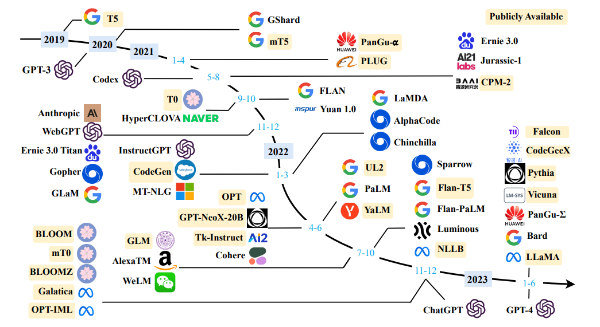
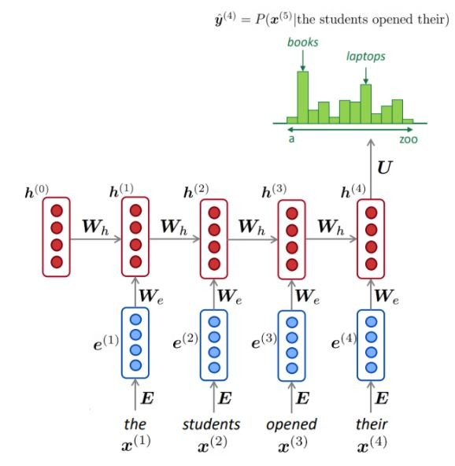
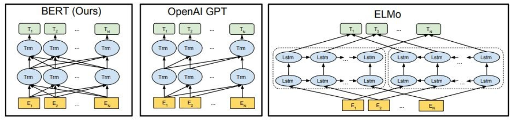
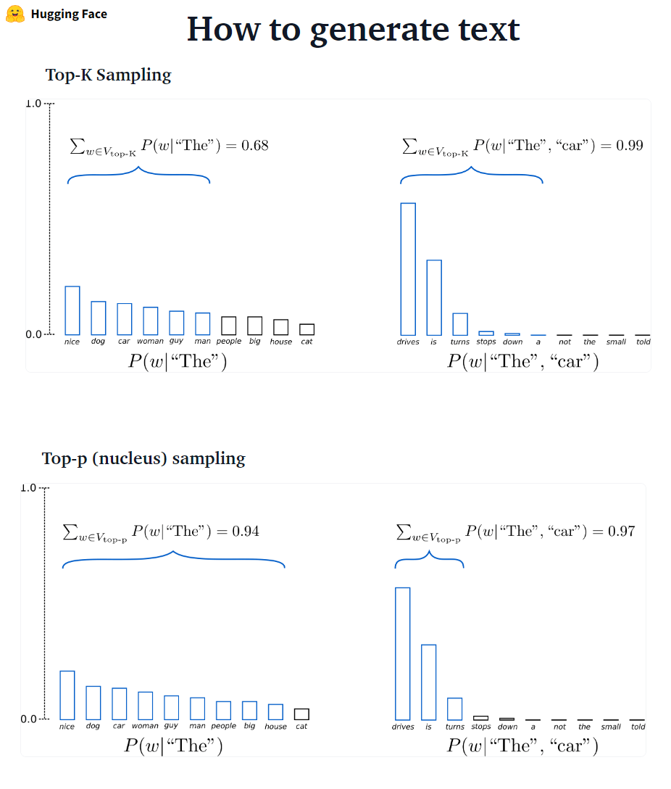
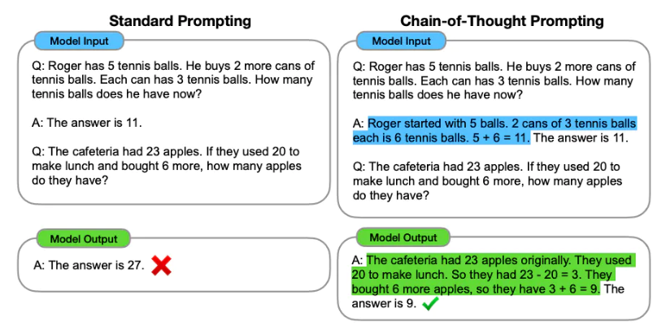
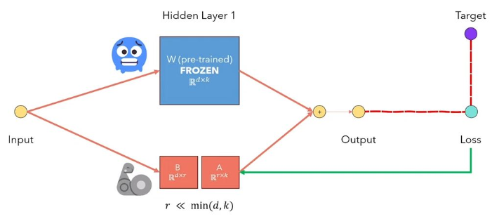
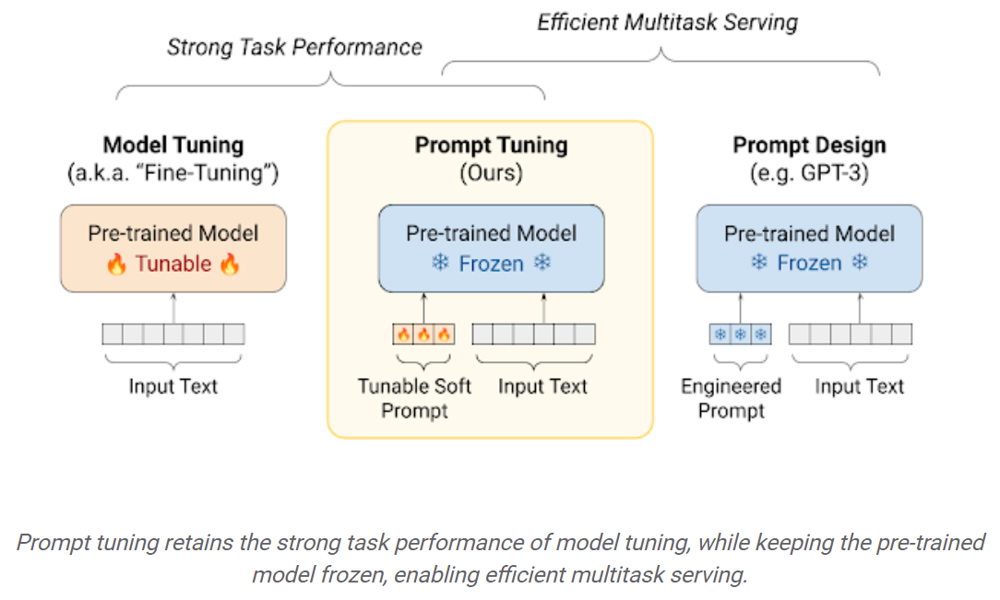
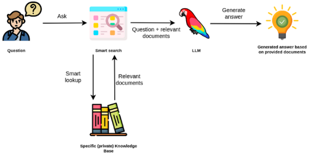
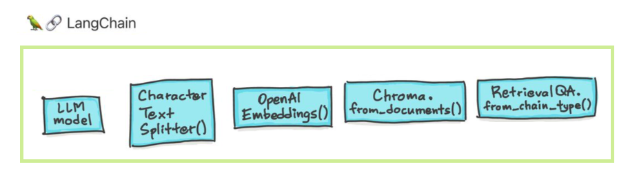
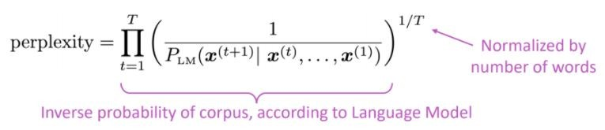

# Large Language Models (LLMs)


*Source: [A Survey of Large Language Models](https://arxiv.org/pdf/2303.18223.pdf)*

Welcome to the comprehensive guide on Large Language Models (LLMs). This repository covers both theoretical foundations and practical implementations of modern language models.

## Quick Navigation

<div class="navigation-grid">
  <div class="nav-card">
    <h3>🚀 Getting Started</h3>
    <p>Learn the fundamentals of language modeling and neural networks</p>
    <a href="#introduction-what-is-a-language-model" class="btn">Start Learning</a>
  </div>
  
  <div class="nav-card">
    <h3>💻 Practical Examples</h3>
    <p>Hands-on tutorials with GPT, BERT, Falcon, and more</p>
    <a href="#-practical-llms" class="btn">View Notebooks</a>
  </div>
  
  <div class="nav-card">
    <h3>🔧 Advanced Topics</h3>
    <p>Fine-tuning, RAG, prompt engineering, and LangChain</p>
    <a href="#-prompt-engineering" class="btn">Explore Advanced</a>
  </div>
  
  <div class="nav-card">
    <h3>🤖 AI Agents</h3>
    <p>Multi-agent systems and agentic workflows</p>
    <a href="/MultiAgents/" class="btn">Learn About Agents</a>
  </div>
</div>

## Related Projects

- **[LMMs: Large Multimodal Models](LMMs/)** - Vision and language models
- **[AI Multi-Agent Systems](MultiAgents/)** - Collaborative AI systems  
- **[Agentic Workflows](Agentic%20Workflows/)** - AI-powered automation

## Content Overview

This comprehensive guide covers:

- **Fundamentals**: Language modeling theory and applications
- **Statistical Models**: N-gram models and their limitations
- **Neural Models**: RNN-based and Transformer-based architectures
- **Evaluation**: Perplexity and other metrics
- **Practical Implementation**: Working with GPT, BERT, Falcon, and CodeT5+
- **Text Generation**: Different decoding strategies
- **Prompt Engineering**: Zero-shot, few-shot, and chain-of-thought prompting
- **Fine-tuning**: Parameter-efficient methods like LoRA
- **RAG**: Retrieval Augmented Generation for enhanced accuracy
- **LangChain**: Building applications with LLMs

---

## Introduction: What is a language model?

**Simple definition**: Language Modeling is the task of predicting what word comes next.

Consider the sentence: *"The dog is playing in the ..."*

Possible completions:
- park ✓
- woods ✓  
- snow ✓
- office ❓
- university ❓
- Neural network ❌

The main purpose of **Language Models** is to assign a probability to a sentence, distinguishing between more likely and less likely sentences.

### Applications of Language Models

Language models power numerous applications across different domains:

| Application | Example | Benefit |
|-------------|---------|---------|
| **Machine Translation** | P(high winds tonight) > P(large winds tonight) | Better translation quality |
| **Spelling Correction** | P(about fifteen minutes from) > P(about fifteen minuets from) | Automatic error detection |
| **Speech Recognition** | P(I saw a van) > P(eyes awe of an) | Improved transcription accuracy |
| **Authorship Identification** | Determining who wrote a text sample | Content attribution |
| **Text Generation** | Summarization, QA, dialogue systems | Creative and informative content |

> Language models are crucial components in recognition systems. Even when speech or vision input is noisy, a good language model helps achieve high accuracy by leveraging linguistic patterns and context.

The language model computes:
- **Next word probability**: P(w₅ | w₁, w₂, w₃, w₄)
- **Sequence probability**: P(w₁, w₂, w₃, ..., wₙ)

Using the **Chain Rule**:
P(x₁, x₂, x₃, …, xₙ) = P(x₁)P(x₂|x₁)P(x₃|x₁,x₂)…P(xₙ|x₁,…,xₙ₋₁)

**Example**: 
P(The, water, is, so, clear) = P(The) × P(water|The) × P(is|The, water) × P(so|The, water, is) × P(clear | The, water, is, so)

---

## Statistical Language Modeling

### N-gram Language Models

Traditional statistical models use large text corpora to collect frequency statistics and predict the next word based on preceding context.

**Example**: For a 4-gram model predicting what follows "students opened their":
- P(books | students opened their) = count(students opened their books) / count(students opened their)

This might yield:
- P(books | students opened their) = 0.4
- P(cars | students opened their) = 0.05

The word "books" is more probable than "cars" in this context.

#### Google's N-gram Models

Google Research processed over **1 trillion words** to create comprehensive n-gram models:

| N-gram Type | Count |
|-------------|-------|
| Unigrams | 13,588,391 |
| Bigrams | 314,843,401 |
| Trigrams | 977,069,902 |
| 4-grams | 1,313,818,354 |
| 5-grams | 1,176,470,663 |

**Example 4-gram data**:
```
serve as the incoming 92
serve as the incubator 99
serve as the independent 794
serve as the index 223
serve as the indication 72
```

### Limitations of Statistical Models

Statistical language models face several challenges:

1. **Sparsity Problem**: Many n-grams never appear in training data
2. **Storage Issues**: Exponential growth in storage requirements
3. **Limited Context**: Typically restricted to n ≤ 5
4. **Long-distance Dependencies**: Cannot capture relationships across distant words

---

## Neural Language Models (NLM)

Neural Language Models address the limitations of statistical models by using neural networks (typically RNNs) to learn word sequences and predict the next word.

### Advantages of Neural Models

| Advantage | Description |
|-----------|-------------|
| **Variable Length Input** | Can process sequences of any length |
| **No Sparsity** | Can handle unseen n-grams through learned representations |
| **Compact Size** | Model size doesn't grow with input length |
| **Shared Parameters** | Same weights applied across all time steps |



### Training Process

1. **Data**: Use large text corpus (e.g., Wikipedia)
2. **Forward Pass**: Feed sentences through the network
3. **Prediction**: Generate probability distribution over vocabulary
4. **Loss**: Compute cross-entropy between predicted and actual next word
5. **Optimization**: Update weights to minimize loss

### Challenges

Despite their advantages, neural language models have limitations:
- **Sequential Processing**: RNNs are slow due to sequential computation
- **Long-term Dependencies**: Difficulty accessing information from many steps back
- **Vanishing Gradients**: Information can be lost over long sequences

---

## Transformer-based Language Models

The introduction of the Transformer architecture revolutionized language modeling by addressing the limitations of RNN-based models.

> "We propose a new simple network architecture, the Transformer, based solely on attention mechanisms, dispensing with recurrence and convolutions entirely" - [Attention is All You Need](https://arxiv.org/abs/1706.03762)

### Key Innovation: Attention Mechanism

The attention mechanism allows every output element to connect to every input element, with weightings dynamically calculated based on context.

### Model Architectures

The Transformer architecture enables two main types of language models:

| Model Type | Architecture | Training Objective | Example |
|------------|--------------|-------------------|---------|
| **Encoder-only** | Bidirectional attention | Masked Language Modeling | BERT |
| **Decoder-only** | Causal attention | Next Token Prediction | GPT |



**Key Differences**:
- **BERT**: Deeply bidirectional, sees entire context
- **GPT**: Unidirectional, only sees previous context
- **ELMo**: Shallowly bidirectional (concatenates forward/backward)

### Pre-training Paradigm

Modern language models follow a two-stage approach:

1. **Pre-training**: Train on massive unlabeled text corpora
2. **Fine-tuning**: Adapt to specific downstream tasks

This approach addresses the shortage of labeled training data for many NLP tasks while leveraging the abundance of unlabeled text.

---

## 💥 Practical LLMs

This section provides hands-on experience with popular language models through interactive notebooks.

### 🚀 Hello GPT-2

[](https://colab.research.google.com/drive/1eBcoHjJ2S4G_64sBvYS8G8B-1WSRLQAF?usp=sharing)

GPT-2 is a causal language model trained on 40GB of internet text. It demonstrates broad capabilities including conditional text generation.

**Key Features**:
- 1.5B parameters (largest public version)
- Trained on diverse web content
- Zero-shot task performance
- Controllable generation

### 🚀 Hello BERT

[](https://colab.research.google.com/drive/17sJR6JwoQ7Trr5WsUUIpHLZBElf8WrVq?usp=sharing)

BERT revolutionized NLP by introducing bidirectional training for language understanding tasks.

**Applications**:
- Text classification
- Named entity recognition
- Question answering
- Sentiment analysis

### 🚀 Falcon

[](https://colab.research.google.com/drive/1Cu4jjKp0VfcGgOPQlTD8nqUdpMdCdpfb?usp=sharing)

Falcon is a powerful open-source language model trained on high-quality curated data.

### 🚀 CodeT5+

[](https://colab.research.google.com/drive/1Ik8w6BgHazuf45E5GrZd0vyx6SV3EOzG?usp=sharing)

CodeT5+ is specialized for code understanding and generation tasks.

**Example Usage**:
```python
from transformers import T5ForConditionalGeneration, AutoTokenizer

checkpoint = "Salesforce/codet5p-770m-py"
tokenizer = AutoTokenizer.from_pretrained(checkpoint)
model = T5ForConditionalGeneration.from_pretrained(checkpoint)

inputs = tokenizer.encode("def factorial(n):", return_tensors="pt")
outputs = model.generate(inputs, max_length=150)
print(tokenizer.decode(outputs[0], skip_special_tokens=True))
```

---

## 🤗 Text Generation Strategies

Different decoding methods produce varying quality and characteristics in generated text.

### Decoding Methods Comparison

| Method | Description | Pros | Cons |
|--------|-------------|------|------|
| **Greedy Search** | Select highest probability word | Fast, deterministic | Repetitive, misses better sequences |
| **Beam Search** | Keep top-k hypotheses | Better quality than greedy | Still deterministic, repetitive |
| **Sampling** | Random selection by probability | More diverse | Can be incoherent |
| **Top-k Sampling** | Sample from top-k words | Balanced quality/diversity | Fixed cutoff |
| **Top-p Sampling** | Sample from cumulative probability p | Dynamic vocabulary | More complex |



### Implementation Example

```python
# Combined top-k and top-p sampling
sample_outputs = model.generate(
    **model_inputs,
    max_new_tokens=40,
    do_sample=True,
    top_k=50,
    top_p=0.95,
    num_return_sequences=3,
)
```

---

## 🧑‍📝 Prompt Engineering

Prompt engineering is the art and science of designing effective inputs to guide language model behavior.

### Prompting Strategies

#### Zero-shot Learning
Direct task specification without examples:

```
Classify the text into neutral, negative or positive.
Text: I think the vacation is excellent.
Sentiment: Positive
```

#### Few-shot Learning
Providing examples to guide the model:

```
Text: This is awesome! → Sentiment: Positive
Text: This is bad! → Sentiment: Negative
Text: Wow that movie was rad! → Sentiment: Positive
Text: What a horrible show! → Sentiment: ?
```

#### Chain-of-Thought (CoT)
Breaking down complex reasoning into steps:



### Best Practices

1. **Be Specific**: Clear, detailed instructions
2. **Provide Context**: Relevant background information
3. **Use Examples**: Demonstrate desired output format
4. **Iterate**: Refine prompts based on results
5. **Consider Constraints**: Length, style, tone requirements

---

## 🚀 Fine-tuning LLMs

Fine-tuning adapts pre-trained models to specific tasks, but full fine-tuning becomes impractical for large models.

### Parameter-Efficient Fine-Tuning (PEFT)

PEFT methods achieve comparable performance to full fine-tuning while training only a small subset of parameters.

#### LoRA (Low-Rank Adaptation)

LoRA freezes pre-trained weights and injects trainable rank decomposition matrices:



**Benefits**:
- Drastically reduced trainable parameters
- Faster training and inference
- Multiple task-specific adapters
- Easy deployment and switching

#### Prompt Tuning

Learn "soft prompts" - continuous vectors that guide model behavior:



**Advantages**:
- Minimal parameters (< 1% of model size)
- Task-specific optimization
- No architectural changes required

---

## 🚀 Retrieval Augmented Generation (RAG)

RAG enhances language models with external knowledge to improve factual accuracy and reduce hallucinations.



### RAG Pipeline

1. **Document Processing**: Convert documents to embeddings
2. **Query Processing**: Convert user query to embedding
3. **Retrieval**: Find relevant documents using similarity search
4. **Augmentation**: Combine query with retrieved context
5. **Generation**: Generate response using augmented prompt

### Benefits

| Benefit | Description |
|---------|-------------|
| **Factual Accuracy** | Access to up-to-date information |
| **Reduced Hallucination** | Grounded in retrieved evidence |
| **Domain Adaptation** | Incorporate specialized knowledge |
| **Transparency** | Traceable information sources |

### Implementation Considerations

- **Embedding Models**: Choose appropriate text encoders
- **Vector Databases**: Efficient similarity search (Pinecone, Weaviate, Chroma)
- **Chunking Strategy**: Optimal document segmentation
- **Retrieval Quality**: Relevance and diversity of retrieved content

---

## 🦜️🔗 LangChain Framework

LangChain simplifies building applications with language models by providing modular components and pre-built chains.



### Core Components

#### 1. LLMs and Prompts
Standardized interface for different language models:

```python
from langchain.llms import OpenAI
from langchain.prompts import PromptTemplate

llm = OpenAI(temperature=0.9)
prompt = PromptTemplate(
    input_variables=["product"],
    template="What is a good name for a company that makes {product}?"
)
```

#### 2. Chains
Sequence multiple components for complex workflows:

```python
from langchain.chains import LLMChain

chain = LLMChain(llm=llm, prompt=prompt)
result = chain.run("colorful socks")
```

#### 3. Data Augmented Generation
Integration with external data sources:

```python
from langchain.document_loaders import TextLoader
from langchain.vectorstores import Chroma
from langchain.embeddings import OpenAIEmbeddings

# Load and process documents
loader = TextLoader("./documents.txt")
documents = loader.load()

# Create vector store
embeddings = OpenAIEmbeddings()
vectorstore = Chroma.from_documents(documents, embeddings)
```

#### 4. Agents
Autonomous decision-making with tool access:

```python
from langchain.agents import initialize_agent, Tool

tools = [
    Tool(
        name="Calculator",
        func=calculator.run,
        description="Useful for math calculations"
    )
]

agent = initialize_agent(tools, llm, agent="zero-shot-react-description")
```

### Use Cases

- **Question Answering**: Over documents, databases, APIs
- **Chatbots**: Conversational interfaces with memory
- **Content Generation**: Automated writing and summarization
- **Data Analysis**: Natural language queries over structured data
- **Workflow Automation**: Multi-step reasoning and action

---

## Evaluation and Metrics

### Intrinsic Evaluation

**Perplexity** remains the standard metric for language model quality:



- **Lower perplexity** = Better model
- Measures how well the model predicts a test set
- Related to branching factor (average number of possible next words)

### Extrinsic Evaluation

Task-specific metrics for downstream applications:

| Task | Metrics |
|------|---------|
| **Text Classification** | Accuracy, F1-score, Precision, Recall |
| **Machine Translation** | BLEU, ROUGE, METEOR |
| **Question Answering** | Exact Match, F1-score |
| **Summarization** | ROUGE, BERTScore |
| **Code Generation** | Pass@k, CodeBLEU |

### Human Evaluation

Critical for assessing:
- **Fluency**: Natural language quality
- **Coherence**: Logical consistency
- **Relevance**: Task appropriateness
- **Safety**: Harmful content detection
- **Bias**: Fairness across demographics

---

## Future Directions

The field of Large Language Models continues to evolve rapidly:

### Emerging Trends

1. **Multimodal Models**: Integration of text, vision, and audio
2. **Efficient Architectures**: Reducing computational requirements
3. **Specialized Models**: Domain-specific optimization
4. **Alignment Research**: Ensuring AI safety and human values
5. **Federated Learning**: Privacy-preserving training methods

### Research Challenges

- **Scaling Laws**: Understanding optimal model size vs. data relationships
- **Emergent Abilities**: Predicting capabilities that arise at scale
- **Interpretability**: Understanding model decision-making processes
- **Robustness**: Handling adversarial inputs and edge cases
- **Efficiency**: Reducing environmental impact and computational costs

---

## Getting Started

Ready to dive into Large Language Models? Here's your roadmap:

### For Beginners
1. Start with the [Hello GPT-2 notebook](https://colab.research.google.com/drive/1eBcoHjJ2S4G_64sBvYS8G8B-1WSRLQAF?usp=sharing)
2. Explore [prompt engineering techniques](#-prompt-engineering)
3. Try the [BERT tutorial](https://colab.research.google.com/drive/17sJR6JwoQ7Trr5WsUUIpHLZBElf8WrVq?usp=sharing)

### For Practitioners
1. Implement [RAG systems](#-retrieval-augmented-generation-rag)
2. Experiment with [fine-tuning methods](#-fine-tuning-llms)
3. Build applications with [LangChain](#️-langchain-framework)

### For Researchers
1. Study the [theoretical foundations](#statistical-language-modeling)
2. Explore [evaluation methodologies](#evaluation-and-metrics)
3. Investigate [emerging architectures](#transformer-based-language-models)

---

## Resources and References

### Essential Papers
- [Attention is All You Need](https://arxiv.org/abs/1706.03762) - The Transformer architecture
- [BERT: Pre-training of Deep Bidirectional Transformers](https://arxiv.org/abs/1810.04805)
- [Language Models are Unsupervised Multitask Learners](https://d4mucfpksywv.cloudfront.net/better-language-models/language_models_are_unsupervised_multitask_learners.pdf) - GPT-2
- [Chain-of-Thought Prompting](https://arxiv.org/abs/2201.11903)
- [LoRA: Low-Rank Adaptation](https://arxiv.org/pdf/2106.09685.pdf)

### Tools and Frameworks
- [Hugging Face Transformers](https://huggingface.co/transformers/)
- [LangChain](https://github.com/langchain-ai/langchain)
- [OpenAI API](https://openai.com/api/)
- [Google Colab](https://colab.research.google.com/)

### Datasets
- [Common Crawl](https://commoncrawl.org/)
- [The Pile](https://pile.eleuther.ai/)
- [C4 (Colossal Clean Crawled Corpus)](https://www.tensorflow.org/datasets/catalog/c4)

---

*This guide is continuously updated to reflect the latest developments in Large Language Models. For questions or contributions, please visit the [GitHub repository](https://github.com/IbrahimSobh/llms).*
